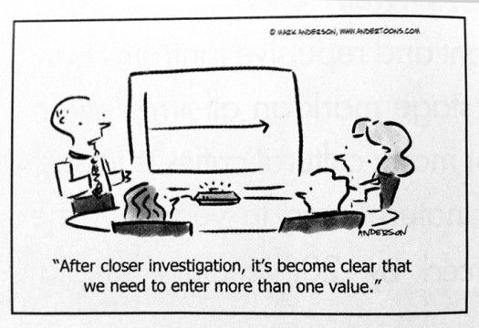

# Cours 1 - Objectifs et Découverte de Processing

À quoi ressemble le chemin suivi par des millions de visiteurs sur un site web ? Comment les 3.1 milliards de base A, C, G et T du génome humain se comparent à celles du chimpanzé ou de la souris ? Sur les milliers de fichiers stockés sur un disque dur, lesquels prennent le plus de place ? Lesquels utilisons nous le plus souvent ?

Notre objectif pour ce cours sera d'utiliser l'informatique, les statistiques, la fouille de données, le design graphique et l'infographie pour répondre à des questions sur ces données, et les rendre compréhensibles et accessibles.

Nous désirons :

* Pouvoir répondre à une question que l'on se pose sur un ensemble de données potentiellement important. 
* Explorer plus facilement des ensembles massifs de données.
* Savoir rapidement expliquer des données aux autres.

### Les 7 étapes de la visualisation des données

Mais utiliser tous ces champs disciplinaires et les concilier n'est pas évident ! Plutôt que de s'intéresser aux données suivant une approche statistique, ou fouille de données ou encore graphique, nous nous proposons de nous poser une unique question : *comment comprendre les données ?* 

En général le processus de compréhension des données commence par un ensemble de nombres et une question que l'on se pose. Les sept étapes suivantes proposent un cheminement vers la réponse :

1. **Acquérir** Obtenir les données à partir d'un fichier, ou d'un réseau.
2. **Analyser** Fournir une structuration aux données et les ordonner en catégories.
3. **Filtrer** Ne conserver que les données d'intérêt.
4. **Miner** Appliquer des méthodes provenant des statistiques ou de la fouille de données pour trouver des motifs ou replacer les données dans un contexte mathématique.
5. **Représenter** Choisir une modèle visuel.
6. **Affiner** Améliorer la représentation basique pour la rendre plus claire et plus compréhensible.
7. **Interagir** Ajouter des méthodes pour manipuler les données ou contrôler ce qui est visible ou non.

Nous allons voir comment mener à bien ces étapes, et pour cela nous vous proposons d'utiliser un outil simple nommé *Processing* .



## Processing

*Processing* est à la fois un environnement et un langage de programmation dont l'objectif est de fournir un moyen simple d'expérimenter des idées en se focalisant principalement sur les résultats graphiques. Il est à la base destiné aux artistes et au graphistes, mais a de plus en plus été utilisé, depuis sa création en 2001, pour la visualisation, et en particulier pour le rendu d'ensembles de données complexes.

À la base Processing est un outil de *prototypage*, c'est à dire qu'il permet rapidement d'expérimenter une idée. Un programme en processing est appelé un *croquis* (*sketch*). Cependant les capacités du langage se sont rapidement développées et désormais Processing 3 est utilisé pour des projets de programmation avancés. 

Processing est basé sur Java. Si vous maîtrisez la programmation dans ce langage, Processing vous semblera étonnamment familier ! (vous verrez alors que Processing est surtout une API utilisable en Java) Cependant, il n'est pas nécessaire de connaître Java pour apprendre à programmer en Processing, et des bases de tout autre langage impératif comme C par exemple sont suffisantes. 

La dernière version de Processing est toujours disponible à l'adresse suivante :

[http://processing.org/download](http://processing.org/download)

Processing fonctionne sous Linux, MacOs et Windows et est open-source, gratuit, libre d'utilisation et libre de droits.

Pour résumer, Processing est constitué de :

* Un environnement de développement minimaliste et utilisable comme introduction au langage Processing (PDE, *Processing Development Environment*).
* Une collection de commandes (fonctions ou méthodes) qui constituent le cœur de l'interface de programmation (API) ainsi que plusieurs librairies fournissant des techniques plus avancées comme le dessin en 3D avec OpenGL, la lecture de fichiers XML, ou la sauvegarde des croquis au format PDF.
* Une syntaxe, identique à celle de Java avec quelques modifications que nous détaillerons dans ce cours.
* Une communauté de plus en plus large, dont le point d'entrée est [http://processing.org](http://processing.org)

## Esquisser en Processing 

Un programme Processing est appelé un *croquis* (*sketch*) ou une esquisse. L'idée consiste à rendre la programmation Java plus proche de la création de scripts, en gardant à l'esprit qu'elle doit être rapide.

Les croquis sont stockés dans un carnet (*sketchbook*). Dans l'environnement de développement, on accède au carnet avec la commande *File → Sketchbook* (*File → Open* reste utilisable bien sûr).

Quand vous serez plus avancés en Processing nous utiliserons l'API Processing en Java directement dans l'environnement de développement de votre choix.

### Hello World !

Bien qu'il existe une console dans Processing, l'équivalent du programme usuel "Hello, World!" en Processing sera avant-tout de dessiner quelque-chose. Nous allons commencer par une simple ligne ! Ouvrez Processing et tapez simplement :

```java
line(15, 25, 70, 90);
```

Appuyez ensuite sur le bouton *run* qui ressemble à une flèche de lecture sur un lecteur audio. Une fenêtre s'ouvre avec un fond gris moyen et une ligne entre les coordonnées `(15,25)` et `(70, 90)`. La coordonnée `(0,0)` se trouve au coin *supérieur gauche* de la fenêtre, l'axe des X vas vers la droite et l'axe des Y vers le bas.

Essayons quelque-chose de plus avancé :

**Exemple 1.1** Un fond coloré et une ligne blanche.

```java
size(400,400);
background(192,64,0);
stroke(255);
line(0, 0, 400, 400);
```

Ce programme :

* Définit la taille du canevas de dessin à 400x400 pixels,
* règle la couleur du fond de la fenêtre en RVB (rouge-vert-bleu). 
* change la couleur de dessin des contours de forme et les lignes en blanc (ici non pas en RVB mais simplement en intensité).
* dessine une ligne entre le coin supérieur gauche et le coin inférieur droit.

Après `stroke` tout ce qui est dessiné sera de cette couleur, jusqu'au prochain appel à `stroke`. En d'autres termes, une variable globale cachée stocke la couleur courante.

Il est possible de spécifier les couleurs de multiples façon :

```java
stroke(255);                // En intensité, ici du blanc (0 pour du noir).
stroke(255, 255, 255);      // Du blanc en composante Rouge-Verte-Bleue.
stroke(255, 128, 0);        // Du orange clair.
stroke(#FF8000);            // La même couleur en notation RVG hexadécimale (ou web).
stroke(255, 128, 0, 128);   // Encore du orange clair mais semi-transparent (RVBA).
```

Notez, si vous souhaitez trouver facilement une couleur qu'un sélecteur de couleur est disponible dans le menu *Tools*.

### Hello mouse !

Un programme tel que celui que nous venons de voir ci-dessus est dit en mode *basique*. Il s'agit simplement d'une suite d'instructions exécutée en une fois par Processing pour produire une image fixe.

Lorsqu'on désire créer une animation, composée de plusieurs images (*frames*) ou créer un programme interactif, on utilise un autre mode de Processing qui requière deux fonctions prédéfinies nommées `setup()` et `draw()`. On appelle ce mode le mode *continu* :

**Exemple 1.2** Le mode continu.

```java
void setup() {
    size(400, 400);
    stroke(255);
    background(192,64,0);
}

void draw() {
    line(0, 0, mouseX, mouseY);
}
```

Dans l'exemple 1.2 nous faisons quasiment la même chose que dans l'exemple 1.1. L'étape `setup()` est réalisée une fois au démarrage du programme. Le bloc `draw()` est quant-à-lui exécuté ensuite en boucle par défaut 60 fois par seconde. Les variables pré-définies `mouseX` et `mouseY` représentant la position actuelle de la souris, nous traçons à chaque image une ligne entre les coordonnées `(0, 0)` et la position de la souris.

Comme son nom l'indique, `setup()` est utilisée pour configurer le croquis. La commande `size()` est particulière, car elle ne peut apparaître que dans `setup()` et elle doit _*nécessairement être en premier*_.

La commande `background()` non seulement change le couleur de fond mais efface aussi l'écran. Comme nous l'avons placée dans `setup()` le croquis est effacé au début du programme, une seule fois, en orange. Ensuite les lignes que nous dessinons dans `draw()` s'accumulent. Il est facile de changer ce comportement :

**Exemple 1.3** effacer l'écran entre chaque image.

```java
void setup() {
    size(400, 400);
    stroke(255);
}

void draw() {
    background(192,64,0);
    line(0, 0, mouseX, mouseY);
}
```

Le mode basique n'est que rarement utilisé, ou pour des programme qui doivent produire une unique image (pour par exemple la sauvegarder ensuite en PDF). La plupart des programmes utilisent le mode continu. Dans ces derniers il est possible de gérer l'interactivité de manière plus avancée. Par exemple il est possible d'intercepter des événements sur les clic de la souris avec un autre fonction prédéfinie nommée `mousePressed()` :

**Exemple 1.4** effacer l'écran uniquement lorsque un bouton de la souris est pressé.

```java
void setup() {
    size(400, 400);
    stroke(255);
}

void draw() {
    line(0, 0, mouseX, mouseY);
}

void mousePressed() {
    background(192, 64, 0);
}
```

## Exporter son travail

Lorsqu'on sauvegarde un croquis, Processing nous offre par défaut de le faire dans le carnet (*sketchbook*). Il est bien entendu possible de sauvegarder à l'emplacement de son choix. Processing crée non seulement un fichier pour le programme, avec l'extension `.pde`, mais il place ce fichier dans un répertoire dont le nom est identique sans l'extension. Nous verrons par la suite que ce répertoire nous permet d'associer facilement des ressources telles que des données ou images au croquis.

Il est facile de créer une application autonome pour Linux, MacOs ou Windows avec le menu `File → Export`.

De même il est possible de sauvegarder le résultat présent dans la fenêtre graphique avec la commande `saveFrame()`, par exemple :

```java
saveFrame("sortie.png");
```

Placée dans `draw()` cette commande écrase à chaque nouvelle image l'image sauvegardée précédemment. Pour sauvegarder une animation, il est possible d'ajouter des `#` au nom du fichier. Par exemple :

```java
saveFrame("sortie-###.png");
```

Ce qui produira les fichiers `sortie-001.png` puis `sortie-002.png` etc. Attention, il est facile de remplir très vite un répertoire avec cette commande.

## Se documenter

L'intégralité des fonctions prédéfinies de Processing sont documentées. Il suffit de surligner le nom d'une fonction et d'appuyer sur `shift-ctrl-F` ou `shift-command-F` pour ouvrir la documentation dans le navigateur.

De très nombreux exemples sont disponibles directement dans le menu `File` de Processing.

## Une question de taille

La commande `size()` doit apparaître en premier dans chaque croquis car elle conditionne le reste du programme. Elle prédéfinit deux variables `width` et `height` qui permettent d'éviter de modifier tout un croquis si on change d'avis sur sa taille.

```java
float w = 50;

size(400, 400);
// La commande ellipse prend en paramètre la position x et y
// de l'ellipse suivies des diametres en x et y.

// Pas très pratique pour faire une ellipse centrée :
ellipse(200, 200, w, w);

// Bien plus pratique si on change la taille du croquis :
ellipse(width/2, height/2, 50, 50);
```

Notez aussi que l'on peut définir des variables qui seront *globales* à tout le croquis au début du programme.

Processing fournit plusieurs modes de rendu, dont celui par défaut utilise l'API Java2D. La commande `size()` peut prendre non pas deux mais trois arguments, le troisième indiquant le moteur de rendu à utiliser. Bien que nous ne les aborderons pas durant ce cours, voici une courte description de chacun :

* `size(400, 400, JAVA2D);` C'est le moteur de rendu par défaut, c'est un bon compromis entre vitesse et qualité de rendu lorsqu'on travaille en 2D.
* `size(400, 400, P2D);` C'est un moteur de rendu spécifique à Processing pour la 2D, il gère bien les opérations simples et les opérations sur les pixels. Il est plus rapide que JAVA2D pour les opérations simples mais dispose de moins d'options de qualité finale de rendu.
* `size(400, 400, P3D);` Comme pour la 2D c'est un moteur spécifique à Processing pour la 3D, optimisé pour la rapidité, au détriment de certaines options de qualité (lissage, etc.).
* `size(400, 400, OPENGL);` Un moteur utilisant la bibliothèque 3D OpenGL pour le rendu. Pour l'utiliser il faut aussi importer la librairie OpenGL (*Sketch → Import Library → OpenGL*) qui fournit des commandes supplémentaires. 
* `size(400, 400, PDF, "sortie.pdf");` Ce moteur de rendu permet d'exporter des croquis au format vectoriel en PDF directement. 

## Charger et afficher des données

Par défaut, un sous-répertoire nommé `data` dans le dossier du croquis courant permet de stocker et retrouver des données diverses. Par exemple les commandes `loadImage()` et `loadStrings()` vont aller chercher les fichiers à cet endroit.

Cette façon de faire possède l'avantage de la simplicité, et permet ensuit un export facile du croquis sous forme d'application.

La fonction `loadStrings()` charge un fichier texte dans un tableau de chaînes de caractère de type `String`. La fonction `loadImage()` charge une image dans un objet de type `PImage` :

```java
String[] lignes = loadStrings("unFicherTexte.txt");
PImage image = loadImage("uneImage.jpg");
```

Pour ajouter un fichier dans le répertoire `data`, il suffit d'utiliser le menu *Sketch → Add File*. Le sous-répertoire `data` est automatiquement créé s'il n'existe pas. Il est bien sûr possible d'ajouter les fichier avec le shell système ou graphiquement. Le menu `Sketch → Show Sketch Folder` permet d'ouvrir un explorateur sur le bon répertoire.

Si les données ne sont pas locales, il est aussi possible d'utiliser des URLs :

```java
String[] lignes = loadString("http://benfry.com/writing/map/locations.tsv");
PImage image = loadImage("http://benfry.com/writing/map/map.png");
```

**Exercice 1.1** On cherche à colorer le fond du croquis avec une couleur variable. Implantez trois boutons nommés R, G et B sous forme de rectangles. Vous aurez besoin d'un gestionnaire d'événements `mousePressed()`, et des variables prédéfinies `mouseX` et `mouseY`. Lorsqu'un bouton pressé avec le bouton gauche de la souris on augmente la composante correspondante rouge, vert ou bleu du fond du croquis. Avec le bouton droit de la souris on décrémente. Vous aurez besoin de la variable prédéfinie `mouseButton` pour ceci. Assurez-vous de ne pas sortir des bornes `[0,255]` (cherchez la commande `constrain()`).

**Exercice 1.2** Faites en sorte que lorsqu'on appuie sur une touche, on passe en mode HSB et que les trois boutons commandent les composantes de Teinte, Saturation et Valeur (cherchez `colorMode()`).
