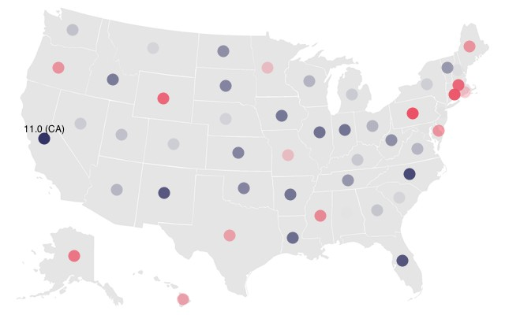
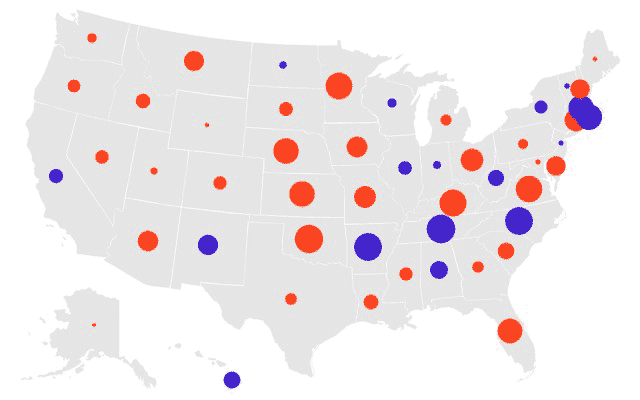
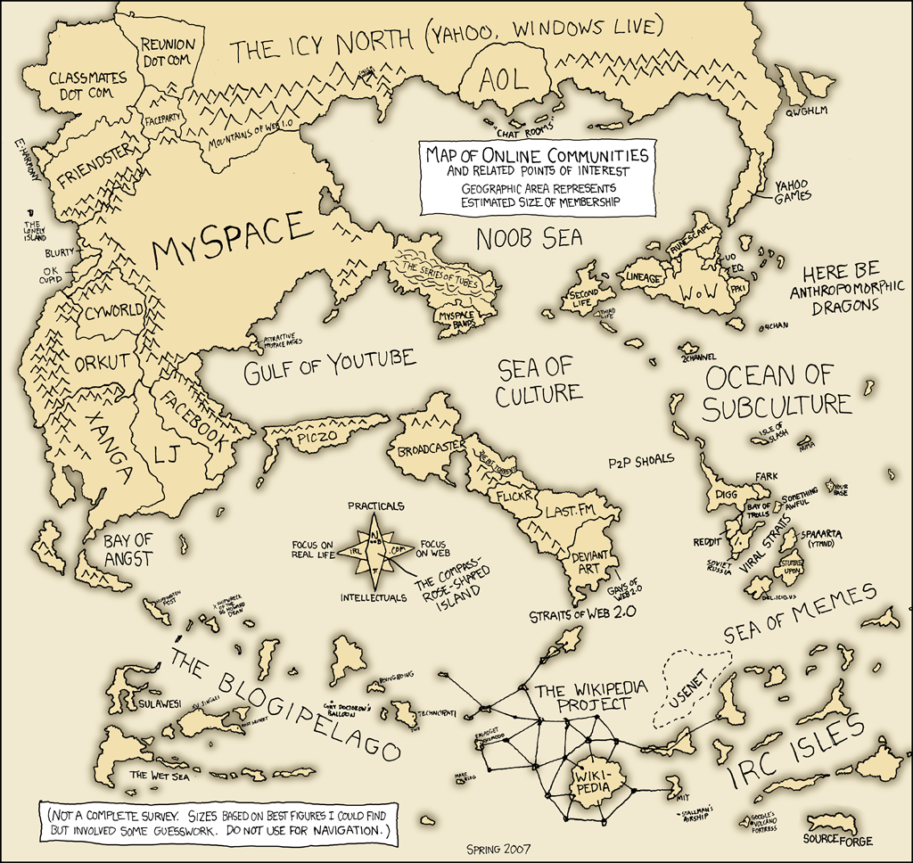

# Cours 2 - Cartographier

Afin de découvrir les bases de la lecture de données, leur affichage et les interactions de base, nous allons utiliser une carte des États-Unis et un ensemble de données des cinquante états. Nous pourrions réaliser ce genre de cartographie avec un logiciel dédié, voire même à la main, mais ce sera une bonne base pour la suite.

Nous verrons comment créer des représentations qui se mettent à jour et comment les interactions peuvent fournir des couches additionnelles d'information.

## Dessiner une carte

Commençons avec un nouveau croquis : *File → New*. 

Téléchargez la carte suivante :


et choisissez *Sketch → Add File* (ou faites un glisser-déposer l'image dans la zone d'édition).

Nous allons ensuite utiliser le code suivant pour charger et afficher l'image :

**Exemple 2.1** Charger une image.

```java
PImage carte;

void setup() {
    size(640, 400);
    carte = loadImage("carte.png");
}

void draw() {
    background(255);    // Blanc.
    image(carte, 0, 0); // Dessine une image dont le coin supérieur gauche est en (0,0).
}
```

## Positions sur une carte

Pour simplifier les choses, téléchargez le fichier suivant :

[positions.tsv](positions.tsv)

Il s'agit d'une fichier texte ou chaque état américain est représenté par une ligne. Chaque ligne contient trois valeurs et ces valeurs sont séparées par des tabulations. L'extension du fichier *tsv* signifie *tab separated values*. Ajoutez ce fichier de la même façon que pour la carte.

Enfin, nous allons pour le moment ajouter un code spécifique pour charger les données au format *tsv*. Il n'est pas nécessaire de comprendre pour l'instant le fonctionnement de ce code, mais il s'agit en fait quasiment d'une classe Java standard, utilisant certaines fonctions de Processing. Téléchargez ce code :

[Table.pde](Table.pde)

Lorsque vous l'ajoutez, vous noterez qu'il n'est pas ajouté dans le répertoire `data`. En effet ce ne sont pas des données. À la place, un nouvel onglet est ouvert. Chaque onglet d'un croquis Processing contient un module du projet, sous la forme d'une classe Java.

Ce code fournit des objets de type `Table` permettant de lire les données tabulées *tsv* sous la forme d'une grille de lignes et de colonnes. Pour y lire des nombres réels il suffit d'utiliser la méthode `table.getFloat(row, column)`. Les lignes et les colonnes commencent à zéro, ainsi si ces dernières ont un titre, le titre de lignes sera dans la colonne zéro et inversement.

**Exemple 2.2** Charger les positions sur la carte.

```java
PImage carte;
Table pos;
int lignes;

void setup() {
    size(640, 400);
    carte = loadImage("carte.png");
    pos = new Table("positions.tsv");
    lignes = pos.getRowCount();
}

void draw() {
    background(255);
    image(carte, 0, 0);

    smooth();
    fill(192, 0, 0);
    noStroke();

    for(int ligne=0; ligne < lignes; ligne++) {
        float x = pos.getFloat(ligne, 1); // Colonne 1.
        float y = pos.getFloat(ligne, 2); // Colonne 2.
        ellipse(x, y, 9, 9);
    }
}
```


Les fonctions suivantes sont nouvelles :

* `smooth()` : permet d'activer l'anti-aliasing (par défaut cependant).
* `fill()` : règle le remplissage des formes.
* `noStroke()` : désactive le dessin des contours de formes.

Ces trois commandes changent le comportement de tout ce qui est dessiné par la suite.

## Données sur une carte

Nous allons ensuite charger un ensemble de données devant apparaître sur la carte. Pour ce faire nous pouvons utiliser notre classe `Table` et charger l'ensemble de données suivant :

[hasard.tsv](hasard.tsv)

Il est important de déterminer les valeurs minimales et maximales. Cet intervalle nous permettra de les associer à d'autres caractéristiques comme la couleur ou la taille d'éléments graphiques.

Nous pouvons faire ceci dans le code d'initialisation, mais nous allons introduire une nouvelle fonction pour cela :

**Exemple 2.3** Charger des données.

```java
PImage carte;
Table pos;
int lignes;

Table donnees;
float dmin = MAX_FLOAT;
float dmax = MIN_FLOAT;

void setup() {
    // ...

    donnees = new Table("hasard.tsv");
    trouverMinMax();
}

void draw() {
    // ...
}

void trouverMinMax() {
    for(int ligne = 0; ligne < lignes; ligne++) {
        float valeur = donnees.getFloat(ligne, 1);
        if(valeur > dmax) dmax = valeur;
        if(valeur < dmin) dmin = valeur;
    }
}
```

Nous allons ensuite associer les données de position avec les données aléatoires que nous venons de charger. On trouve dans les deux ensembles des titres pour chaque ligne basés sur le nom des états. Nous allons utiliser la méthode `getRowName()` de `Table` pour obtenir le nom d'une ligne donnée, ensuite les fonctions `getFloat` sont surchargées pour prendre un titre de ligne plutôt qu'un numéro, nous utiliserons ces versions pour *croiser* les données d'un ensemble avec l'autre.

Nous utiliserons les données nouvellement chargées pour faire varier la taille des points sur la carte.

Voici la nouvelle fonction `draw()` : 

**Exemple 2.4** Croiser les données.

```java
void draw() {
    background(255);
    image(carte, 0, 0);

    smooth();
    fill(192, 0, 0);
    noStroke();

    for(int ligne = 0; ligne < lignes; ligne++) {
        // La clé nous sera utile pour retrouver les valeurs dans l'autre
        // ensemble de données.
        String cle = donnees.getRowName(ligne);
        float x = pos.getFloat(cle, 1);
        float y = pos.getFloat(cle, 2);
        dessinerDonnees(x, y, cle);
    }
}

void dessinerDonnees(float x, float y, String cle) {
    // Croise la donnée avec la position.
    float valeur = donnees.getFloat(cle, 1);
    // On transforme la valeur de son intervalle de définition vers l'intervalle [2,40].
    // La fonction map est prédéfinie par Processing.
    float taille = map(valeur, dmin, dmax, 2, 40);
    // Enfin on dessine une ellipse dont la taille varie en fonction de la valeur.
    ellipse(x, y, taille, taille);
}
```


### Utiliser la couleur

Plutôt que de faire varier la taille des éléments, nous pouvons choisir de faire varier la couleur, par exemple en *interpolant* entre deux couleurs représentant les valeurs basses et hautes. La fonction `norm()` permet de normaliser une valeur d'un intervalle donné vers l'intervalle [0,1] :

```java
float pourcent = norm(valeur, dmin, dmax);
```

La fonction `lerp()` réalise l'inverse, elle convertit une valeur normalisée vers un autre intervalle (les fonctions `norm()` et `lerp()` forment la base de la fonction `map()`). La fonction `lerpColor()` fait la même chose avec des couleurs. Ainsi :

```java
color entre = lerpColor(couleur1, couleur2, pourcent);
```

Au passage nous voyons que Processing utilise un type nommé `color` pour représenter les couleurs.

Changeons la fonction `dessinerDonnees()` :

```java
void dessinerDonnees(float x, float y, String cle) {
    float valeur = donnees.getFloat(cle, 1);
    float pourcent = norm(valeur, dmin, dmax);
    color couleur = lerpColor(#FF4422, #4422CC, pourcent);
    fill(couleur);
    ellipse(x, y, 15, 15);
}
```

Ou mieux :

```java
void dessinerDonnees(float x, float y, String cle) {
    fill(lerpColor(#FF4422, #4422CC, norm(donnees.getFloat(cle, 1), dmin, dmax)));
    ellipse(x, y, 15, 15);
}
```


L'interpolation dans l'espace de couleur RGB peut souvent donner des valeurs intermédiaires tirant vers le gris si les couleurs sont similaires (par exemple interpoler à 50% entre le orange (255,128,0) et le bleu clair (0,128,255) donne du gris (128, 128, 128)). Dans ce cas il est souvent plus pratique d'utiliser l'espace de couleur TSV (Teinte-Saturation-Valeur, ou HSB Hue-Saturation-Value). Si les valeurs de couleur sont très éloignées sur le spectre en revanche l'espace HSV produira des couleurs interpolées très variées (par exemple, aller du rouge au vert dans l'espace TSV passera par quasiment toutes les valeurs du spectre).

On peut réaliser une interpolation en TSV ainsi :

```java
lerpColor(#296F34, #61E2F0, pourcent, HSB);
```

## Intervalles de données séparés

Une meilleure option pourrait tirer parti du fait que les données que nous chargeons sont positives et négatives. Nous pourrions changer la taille des points, et les colorer d'une couleur s'ils sont positifs, d'une autre s'ils sont négatifs. Ceci permet d'attirer l'attention sur une séparation nette entre les valeurs.

Pour ce faire, nous nous proposons de faire des ellipses bleues de plus en plus larges entre 3 et 30 pixels pour les valeurs positives, et de même sur une échelle inversée et en rouge pour les valeurs négatives.

**Exercice 2.1** Montrez une séparation nette entre les valeurs positives et négatives en coloriant en bleu les valeurs positives et en rouge celles qui sont négatives. La taille des ellipses varie entre 3 et 30 pixels. Plus une valeur positive est élevée plus l'ellipse correspondante est large. Plus une valeur négative est basse, plus l'ellipse correspondante est large.

Vous ne devriez avoir à changer que la fonction `dessinerDonnees()` ou a créer une autre fonction `dessinerDonnees2()` par exemple.


## Transparence

Dans l'exercice précédent nous avons utilisés deux indicateurs pour une seule dimension de donnée. Pour des données simples cela rend les choses bien plus lisibles. Mais nous pourrions avoir à traiter des données à deux dimensions, auquel cas couleur et taille pourraient être plus pratique à associer à chaque dimension. 

Afin de conserver la taille pour une autre dimension de donnée, nous pourrions à la place utiliser la transparence (ou canal alpha) pour les couleurs. Les couleurs en Processing sont définies par un triplet RVB ou un quadruplet RVBA, ou le A indique la transparence plus cette valeur est proche de zéro plus la couleur est transparente. Par exemple :

```java
fill(255, 0, 0, 128);
```

Crée un rouge vif semi-transparent. Mais on aurait aussi pu écrire :

```java
fill(#FF0000, 128);
```

Pour utiliser la notation `web`.

**Exercice 2.2** Conservez une taille identique pour chaque ellipse et faites varier la transparence à la place.


## Interagir pour fournir plus d'information

Ajouter un peu d'interaction peut rendre un affichage plus utile. Par exemple nous pourrions afficher plus d'informations sur un point de donnée lorsque la souris le survole. 

Avant de faire cela nous devons appendre à gérer le texte avec Processing. Bien que Processing puisse utiliser les polices de caractère du système, il est préférable en général de créer une version donnée d'une police en bitmap afin de pouvoir exporter le croquis sous forme d'application sur des systèmes où la police ne serait pas installée. Le menu *Tools → Create Font* permet de créer la police de votre choix et la stocke dans le répertoire de donnée de votre croquis.

Par exemple une police *Helvetica* en taille 12 générera un fichier `"Helvetica-12.vlw"` dans le répertoire `data`.

Ensuite charger une police est facile, dans `setup()` :

**Exemple 2.5** Charger une police.

```java
PFont font = loadFont("Helvetica-12.vlw");
textFont(font);     // Spécifie la police à utiliser par la suite.
textAlign(CENTER);  // Spécifie que le texte est centré par rapport aux coordonnées de dessin.
```

Faire apparaître les données consistera à calculer la distance entre un point de donnée et la souris et à utiliser la commande `text(chaine, x, y)` pour afficher les valeurs numériques. La distance entre deux points peut être calculée avec la fonction prédéfinie `dist(x0, y0, x1, y1)`.

**Exercice 2.3** Affichez les valeurs numériques associées aux points au dessus de ces derniers quand la souris les survole.



## Un peu de dynamique !

Si les données peuvent changer, pourquoi ne pas créer une version dynamique de la carte ?

Nous pourrions dans notre exemple remplacer les données par des valeurs aléatoires à chaque fois que la barre d'espace est pressée. Un problème important consiste encore une fois à connaitre les valeurs minimum et maximum des données, y compris à travers le temps, nous ne pouvons pas les recalculer comme nous le faisions avec les données statiques : en effet les nouvelles données pourraient changer de proportion. La plupart du temps le mieux est de savoir quelles sont les valeurs minimales et maximales sur l'intégralité de l'affichage. 

Ici nous contrôlons la génération des données nous allons donc fixer le minimum à -10 et le maximum à 10. Nous pouvons désormais nous passer du code de calcul du minimum et maximum.

```java
Table donnees;
float dmin = -10;
float dmax = 10;
```

Pour gérer le clavier et la touche espace, nous pouvons utiliser une méthode "événement" pré-définie de Processing nommée `keyPressed()` ainsi que la variable pré-définie elle aussi `key` :

```java
void keyPressed() {
    if(key == ' ')
        majDonnees();
}
```

La fonction `majDonnees()` pourrait ressembler à cela, en utilisant la fonction `random(borneMinIncluse, borneMaxExcluse)` :

```java
void majDonnees() {
    for(int ligne = 0; ligne < lignes; ligne++) {
        float nouvVal = random(dmin, dmax);
        donnees.setFloat(ligne, 1, nouvVal);
    }
}
```


Cependant, les données changent brutalement d'une valeur à l'autre. Le plus souvent il est important de montrer aux utilisateurs la transition entre une valeur et la valeur suivante. Pour ce faire nous pouvons *interpoler* les données entre l'ancienne valeur et la nouvelle. Cela signifie que la valeur affichée ne sera jamais juste égale à un nombre donné mais sera "*en train de devenir*" un nombre donné.

Processing peut nous aider à faire cela grâce aux intégrateurs. Vous pouvez télécharger le prototype d'un intégrateur avec le fichier suivant, à ajouter à votre croquis :

[Integrator.pde](Integrator.pde)

Nous expliquerons son fonctionnement interne par la suite, mais en gros il s'agit d'un interpolateur physique : une force est appliquée sur une valeur de façon à ce que celle-ci atteigne une valeur cible, à la façon d'un ressort. L'important à noter avec cette classe est qu'elle représente une valeur unique. On peut la créer avec une valeur initiale ainsi :

```java
Integrator nombre = new Integrator(4);
```

Ensuite pour faire la transition progressive entre la valeur initiale et une valeur cible on peut utiliser la méthode `target()` :

```java
nombre.target(-2);
```

Pour que la valeur fasse la transition il faut appeler la méthode `update()` :

```java
nombre.update();
```

En général on appelle `update()` au début de `draw()`. Il faut bien sûr appeler plusieurs fois `update()` afin que la valeur fasse sa transition.

Ici notre exemple n'utilise pas une simple donnée, mais cinquante, pour les cinquante états. Nous allons donc créer un tableau d'intégrateurs dans `setup()`, appeler `update()` sur chacun au début de `draw()` et utiliser `target()` dès qu'on appuie sur la touche espace.

Voici le code correspondant, en reprenant l'apparence de l'exercice 2.1.

**Exemple 2.6** Affichage dynamique et transitions

```java
PImage carte;
Table pos;
int lignes;
Table donnees;
float dmin = -10;
float dmax = 10;
Integrator[] interp;

void setup() {
    size(640, 400);
    carte = loadImage("carte.png");
    pos = new Table("positions.tsv");
    lignes = pos.getRowCount();
    donnees = new Table("hasard.tsv");

    // On charge les valeurs initiales dans les interpolateurs :
    interp = new Integrator[lignes];
    for(int ligne = 0; ligne < lignes; ligne++) {
        interp[ligne] = new Integrator(donnees.getFloat(ligne, 1));
    }

    noStroke();
}

void draw() {
    background(255);
    image(carte, 0, 0);
    for(int ligne = 0; ligne < lignes; ligne++) {
        interp[ligne].update();
        String cle = donnees.getRowName(ligne);
        float x = pos.getFloat(cle, 1);
        float y = pos.getFloat(cle, 2);
        dessinerDonnees(x, y, cle, ligne);
    }
}

void dessinerDonnees(float x, float y, String cle, int ligne) {
    float valeur = interp[ligne].value;

    float taille = 0;
    if(valeur >= 0) {
        taille = map(valeur, 0, dmax, 3, 30);
        fill(#4422CC);
    } else {
        taille = map(valeur, 0, dmin, 3, 30);
        fill(#FF4422);
    }
    ellipse(x, y, taille, taille);
}

void keyPressed() {
    if(key == ' ') majDonnees();
}

void majDonnees() {
    for(int ligne = 0; ligne < lignes; ligne++) {
        interp[ligne].target(random(-10, 10));
    }
}
```



Les changements seront assez rapides. Il existe deux façons de contrôler la vitesse.

La première consiste à changer le nombre d'images par seconde. La commande `frameRate()` (en général placée dans `setup()`) permet d'indiquer combien de fois le bloc `draw()` est exécuté par seconde. La plupart du temps cet intervalle peut être respecté, sauf si l'exécution de `draw()` prend plus de temps que celui imparti entre chaque image.

Par défaut Processing essaye d'afficher 60 images par secondes, il est très souvent suffisant de demander 30 images par secondes :

```java
void setup() {
    // ...
    frameRate(30);
    // ...
}
```

La seconde technique pour gérer la vitesse consiste à paramétrer les intégrateurs : ces derniers simulent un ressort. La valeur cible est la taille au repos du ressort. On peut régler la friction et le degré d'attraction. Les valeurs par défaut sont 0.5 pour le friction et 0.2 pour l'attraction :

```java
Integrator i = new Integrator(valeurInit, 0.5, 0.2);
```

## Utiliser vos propres données

**Exercice 2.4** **À Rendre** On désire réaliser une visualisation interactive et dynamique de deux jeux de données sur une carte. 

Le premier jeu de donnée indique le nombre de fans de Game of Thrones dans chaque région. Le second jeu de donnée fournit un chiffre entre 1 et 4 indiquant quelle maison est préférée majoritairement par les fans de cette région (1 Barathéon, 2 Targaryen, 3 Stark, 4 Lannister). 

Trouvez la carte d'un pays de votre choix (autre que les États-Unis) divisée en régions. Créez un fichier *fans.tsv* indiquant pour chaque région le nombre de fans de GoT. Créez un autre fichier *maisons.tsv* indiquant pour chaque région la maison majoritairement favorite des fans. Vous pouvez bien sûr remplir ces fichiers aléatoirement. 

La visualisation doit indiquer visuellement pour chaque région les deux valeurs, nombre de fans, maison majoritaire, vous pouvez le faire avec la technique de votre choix (taille-couleur, taille-images, transparence-couleur, etc.).

La visualisation doit se mettre-à-jour avec des valeurs aléatoires lorsqu'on appuie sur une touche, et la mise-à-jour doit être progressive. Lorsqu'on passe la souris sur un point de donnée, des informations plus complètes (nombre de fans, maison) doivent apparaître.



 