# Séries temporelles

Les séries temporelles sont un type d'ensemble de données parmi les plus courants. Elles décrivent comment une caractéristique donnée évolue dans le temps, par exemple la population, les températures, le nombre de produits vendus, les fans de Douglas Adams.

De part leur utilisation répandue, les séries temporelles sont un bon point de départ pour apprendre à visualiser les données. Nous verrons :

* Charger une table de données à partir d'un fichier texte.
* Analyser le contenu de cette table sous une forme structurée.
* Calculer les bornes de ces données pour faciliter leur représentation.
* Trouver une représentation appropriée et considérer des alternatives.
* Affiner la représentation en considérant : le placement, les types, l'épaisseur des lignes et la couleur.
* Fournir un moyen d'interagir avec les données de façon à qu'il soit aisé de comparer les variables les unes avec les autres ou avec une moyenne de l'ensemble des données.

De plus en plus de portails "open data" s'ouvrent sur Internet, et récupérer des données de ce type est assez facile. Pour ce cours, nous utiliserons un ensemble de données indiquant l'évolution de la consommation de lait, de thé et de café entre 1910 et 2004. Le fichier suivant :

[lait-the-cafe.tsv](lait-the-cafe.tsv)

contient trois colonnes, une pour le lait, suivie d'une pour le thé, et enfin une pour le café. Chaque ligne a pour titre l'année correspondante :

```
Année   Lait    Thé     Café
1910    32.2    9.6     21.7
1911    31.3    10.2    19.7
1912    34.4    9.6     25.5
1913    33.1    8.5     21.2
...
```

Nous utiliserons une version modifiée de la classe `Table` qui stocke directement des nombres réels. L'autre version stocke des chaînes de caractères et fait la conversion au vol dès qu'on accède aux données :

[FloatTable.pde](FloatTable.pde)

Ouvrez Processing et commencez un nouveau croquis en important les deux fichiers ci-dessus. 

Nous allons essayer de suivre les 7 étapes de conception.

## Faire du propre (filtrer et faire de la fouille)

Comme précédemment, la première chose à faire consiste en général à calculer les minimums et maximums de chaque colonne. La classe `FloatTable` contient des méthodes `getColumnMin()` et `getColumnMax()` réalisant cette opération pour nous. Si vous regardez ce code, vous noterez qu'elle vérifient que chaque valeur est un nombre valide. En effet il n'est pas rare de trouver des ensembles de données dans lesquels certaines données sont manquantes ou corrompues.

Cependant ici, nous allons comparer les valeurs de lait, thé et café entre elles, il est donc nécessaire de connaître les minimum et maximum globaux. Ceci peut être réalisé avec `getTableMin()` et `getTableMax()`.

Nous chargerons donc les données ainsi :

**Exemple 3.1** Charger les données de séries temporelles.

```java
FloatTable donnees;
float dmin, dmax;

void setup() {
    donnees = new FloatTable("lait-the-cafe.tsv");
    dmin = 0;
    dmax = donnees.getTableMax();
}
```

Nous choisissons de placer le minimum à zéro, de façon à ne pas faire croire lors de l'affichage que la consommation d'un liquide ou d'un autre est à zéro alors que c'est le minimum.

Chaque ligne du fichier commence par une année, mais cette dernière est vue comme un label et donc stockée comme une chaine par `FloatTable`. Cependant, il sera aussi utile de connaitre les minimums et maximums pour les années. Les conversions (*cast*) avec Processing se font différemment par rapport à Java. Il existe une fonction `int()` qui convertit ses arguments en entiers, cela fonctionne aussi pour les tableaux !

**Exemple 3.2** Déterminer les années min et max.

```java
FloatTable donnees;
float dmin, dmax;
int amin, amax;
int[] annees;

void setup() {
    donnees = new FloatTable("lait-the-cafe.tsv");
    dmin = 0;
    dmax = donnees.getTableMax();
    annees = int(donnees.getRowNames());
    amin = annees[0];
    amax = annees[annees.length - 1];
}
```

## Un premier tracé (représenter et affiner)

Nous allons essayer de créer un croquis de tracé de courbe suffisamment générique pour être réutilisé. Pour commencer il faut délimiter les bords de la représentations. Cela nous permettra d'y placer des légendes et des axes. Nous définissons quatre variables `traceX1`, `traceY1`, `traceX2` et `traceY2`. Nous choisissons une marge de 50 pixels pour `traceX1` et `traceY1` et `width-traceX1` pour `traceX2` ainsi que `height-traceY1` pour `traceY2`. Cela équilibre les marges et reste générique si on change d'avis.

**Exemple 3.3** Définir un cadre.

```java
FloatTable donnees;
float dmin, dmax;
int amin, amax;
int[] annees;
float traceX1, traceY1, traceX2, traceY2;

void setup() {
    size(720, 405);

    donnees = new FloatTable("lait-the-cafe.tsv");
    dmin = 0;
    dmax = donnees.getTableMax();
    annees = int(donnees.getRowNames());
    amin = annees[0];
    amax = annees[annees.length - 1];

    traceX1 = 50;
    traceY1 = 50;
    traceX2 = width - traceX1;
    traceY2 = height - traceY1;

    smooth();
}
```

Enfin il reste à dessiner les courbes, nous allons commencer par la courbe pour le lait. Nous commençons par dessiner un arrière-plan blanc uniquement dans les bornes du tracés. Le fond du croquis lui est gris. Cela permettra de rendre la lecture des points de données plus claire.

La méthode `rect()` par défaut prend normalement les paramètres `rect(x, y, width, height)`, mais le mode `rectMode(CORNERS)` permet d'interpréter les quatre paramètres comme `rect(left, top, right, bottom)`. Cela est très pratique car c'est ainsi que nous avons défini les bordures de notre zone de dessin. Tout comme les commandes de dessins que nous avons déjà utilisé, `rectMode()` change le mode de dessin de tous les rectangles dessinés par la suite.

**Exemple 3.4** Dessiner une courbe.

```java
void draw() {
    background(224);

    fill(255);
    rectMode(CORNERS);
    noStroke();
    rect(traceX1, traceY1, traceX2, traceY2);
    strokeWeight(5);
    stroke(#5679C1);
    dessinePointsDonnees(0);
}

void dessinePointsDonnees(int col) {
    int lignes = donnees.getRowCount();
    for(int ligne = 0; ligne < lignes; ligne++) {
        if(donnees.isValid(ligne, col)) {
            float valeur = donnees.getFloat(ligne, col);
            float x = map(annees[ligne], amin, amax, traceX1, traceX2);
            float y = map(valeur, dmin, dmax, traceY2, traceY1);
            point(x, y);
        }
    }
}
```


Nous avons placé le code de dessin des points à part, avec comme paramètre le numéro de la colonne à dessiner afin de pouvoir superposer aisément les courbes, ou les intervertir par la suite.

La fonction `point()` dessine par défaut un point d'un pixel de large. Tout comme les contours des objets (si `noStroke()` n'a pas été appelé avant) sont de 1 pixel de large. La commande `strokeWeight()` s'occupe de changer cette valeur. 

Ici encore, la fonction `map()` fait tout le travail en convertissant les données de leur intervalle de définition vers la zone dessin en pixels. L'intervalle des années est associé à la largeur de la zone de dessin et l'intervalle des courbes est associé à la hauteur.

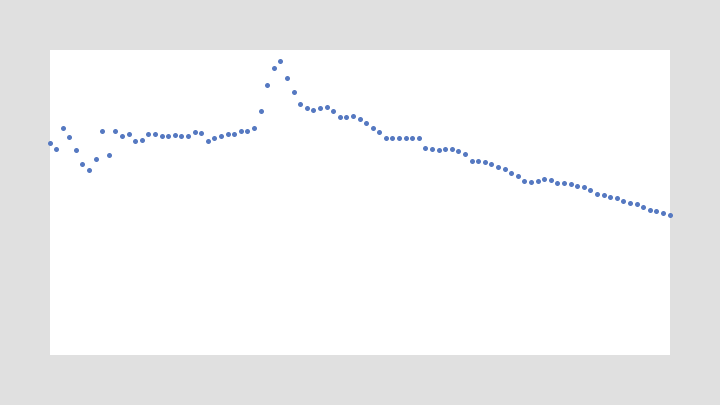

## Ajouter des titres et gérer les polices (raffiner et interagir)

Il manque encore des informations cruciales, comme un titre indiquant quelle colonne de donnée est affichée et un moyen de passer d'une courbe à l'autre. Nous aurons donc besoin de savoir quelle est la colonne courante une d'une police de caractères.

**Exemple 3.5** Un titre et une colonne courante (les changement sont indiqués par des commentaires).

```java
FloatTable donnees;
float dmin, dmax;
int amin, amax;
int[] annees;
float traceX1, traceY1, traceX2, traceY2;
// La colonne de données actuellement utilisée.
int colonne = 0;
// Le nombre de colonnes.
int ncol;
// La police de caractères.
PFont police;

void setup() {
    size(720, 405);

    donnees = new FloatTable("lait-the-cafe.tsv");
    ncol = donnees.getColumnCount();        // Le nombre de colonnes.
    dmin = 0;
    dmax = donnees.getTableMax();
    annees = int(donnees.getRowNames());
    amin = annees[0];
    amax = annees[annees.length - 1];

    traceX1 = 50;
    traceY1 = 50;
    traceX2 = width - traceX1;
    traceY2 = height - traceY1;

    police = createFont("SansSerif", 20);
    textFont(police);

    smooth();
}

void draw() {
    background(224);

    fill(255);
    rectMode(CORNERS);
    noStroke();
    rect(traceX1, traceY1, traceX2, traceY2);
    
    // Dessine le titre.
    fill(0);
    textSize(20);
    text(donnees.getColumnName(colonne), traceX1, traceY1 - 10);

    strokeWeight(5);
    stroke(#5679C1);
    dessinePointsDonnees(colonne); // ! On utilise la colonne courante.
}

// ...
```

Avec `createFont()` il n'est pas nécessaire de stocker une police dans le répertoire `data`. Cela fonctionne pour les polices stockées localement sur le disque dur, mais attention :

* si vous exportez votre croquis sous la forme d'une application, la police utilisée peut ne pas être disponible sur les machines où l'application s'exécutera.
* les polices par défaut du système (`SansSerif`, `Serif`, `Monospace`) varient d'un système à l'autre.

Pour connaitre la liste des polices installées que Processing peut utiliser, vous pouvez utiliser la commande `println(Font.list())`.

Enfin il faut savoir que `createFont()` peut aussi charger une police vectorielle stockée dans le répertoire `data` si cette dernière est au format `.ttf` (*TrueType*) ou `.otf` (*OpenType*). Utilisez simplement le nom du fichier de police en paramètre. Attention aux polices possédant un copyright si vous distribuez votre croquis.

Il nous reste à permettre de changer la colonne de données affichée. 

**Exercice 3.1** Ajoutez un gestionnaire d'événements permettant de passer à la colonne suivante lorsque la touche `->` est pressée et à la colonne précédente lorsque `<-` est pressée. Pour ce faire vous aurez besoin de la variable prédéfinie `keyCode` et des constantes prédéfinies `LEFT` et `RIGHT`.

## Dessiner les axes (Affiner)

Un graphe sans valeurs sur les axes n'est d'aucune utilité. Il nous faut indiquer les unités et les valeurs. Il existe un certain nombre de techniques permettant de déterminer automatiquement le nombre de divisions nécessaires sur chaque axe afin de numéroter ces-derniers. Mais elles sont souvent complexes. Nous nous contenterons pour l'instant de choisir le nombre de divisions à la main. La règle générale est qu'en dessous de 5 c'est trop peu, au delà de 10 c'est certainement trop. 

La meilleure façon de choisir comment numéroter les axes consiste à considérer comment le diagramme sera lu et quelles comparaisons sur l'évolution des données seront faites. Parfois, il n'est pas nécessaire de numéroter les valeurs si seule l'évolution montante ou descendante est importante ! 

### Les années

L'axe des années est assez facile, nous allons de 1910 à 2004, donc des intervalles de 10 années, marquant les années 1910, 1920, 1930, etc. fonctionnera bien. Nous pouvons ajouter une variable `intervalleAnnees = 10;` au début du programme, puis :

```java
void dessineAxeAnnees() {
    fill(0);
    textSize(10);
    textAlign(CENTER, TOP);
    int lignes = donnees.getRowCount();
    for(int ligne = 0; ligne < lignes; ligne++) {
        if(annees[ligne] % intervalleAnnees == 0) {
            float x = map(annees[ligne], amin, amax, traceX1, traceX2);
            text(annees[ligne], x, traceY2 + 10);
        }
    }
}
```

Bien sûr, n'oubliez pas d'ajouter un appel à `dessineAxeAnnees()` dans `draw()`...

Notez l'utilisation de `textAlign()` cette fois nous choisissons l'alignement horizontal en premier paramètre (`LEFT`, `RIGHT`, `CENTER`), mais aussi l'alignement vertical (`TOP`, `BOTTOM`, `BASELINE`, `CENTER`). L'alignement `BASELINE` est celui par défaut. 

Si vous utilisez ceci, vous devriez noter que le titre se décale ! En effet, nous changeons l'alignement du texte dans `dessineAxeAnnees()` mais nous ne le remettons pas aux valeurs par défaut avant de dessiner le titre. En exercice, corrigez le problème !

La plupart du temps, il est aussi nécessaire d'ajouter des repères de grille pour mieux identifier l'alignement des labels et des points de données. Nous pouvons faire ceci directement dans notre fonction `dessineAxeAnnees()` :

```java
void dessineAxeAnnees() {
    fill(0);
    textSize(10);
    textAlign(CENTER, TOP);

    // Des lignes fines en gris clair.
    stroke(224);
    strokeWeight(1);

    int lignes = donnees.getRowCount();
    for(int ligne = 0; ligne < lignes; ligne++) {
        if(annees[ligne] % intervalleAnnees == 0) {
            float x = map(annees[ligne], amin, amax, traceX1, traceX2);
            text(annees[ligne], x, traceY2 + 10);
            // Dessine les lignes.
            line(x, traceY1, x, traceY2);
        }
    }
}
```

Assurez-vous que les lignes de grille passent sous les points de données !

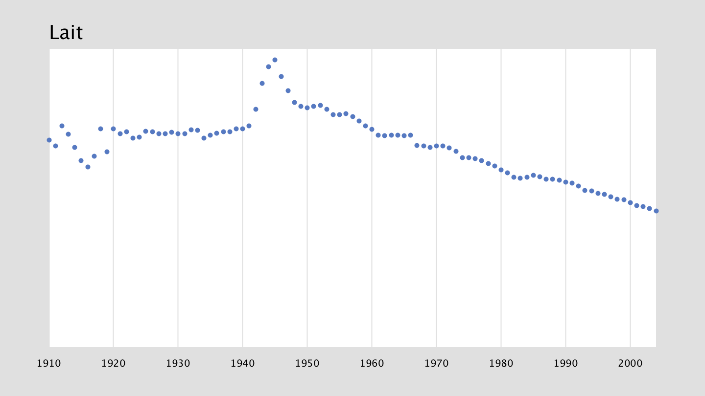

Afin de rendre les choses plus propres, il est aussi préférable d'avoir une fonction à part pour dessiner le titre. Remplacez le code de dessin du titre par :

```java
void dessineTitre() {
    fill(0);
    textSize(20);
    textAlign(LEFT);
    text(donnees.getColumnName(colonne), traceX1, traceY1 - 10); 
}
```

### Les volumes

Cela sera légèrement plus compliqué. Un rapide ajout de `println(dmax)` dans le `setup()` nous apprend que la valeur maximum des données est *46.4*. Donc des intervalles de valeur 10 nous seront encore une fois pratiques, ce qui fera 5 divisions :

```java
int intervalleVolume = 10;
```

Cependant la valeur max des données ne sera pas visible, de plus il serait pratique d'arriver à 50 pour marquer un axe. Nous pouvons faire ceci assez aisément en divisant `dmax` par `intervalleVolume`, soit ici *4.64*, en prenant la valeur de `ceil()` sur ce nombre soit *5* puis en re-multipliant par `intervalleVolume`, soit *50* :

```java
dmax = ceil(donnees.getTableMax() / intervalleVolume) * intervalleVolume;
```

Il ne reste qu'à dessiner l'axe :

```java
void dessineAxeVolume() {
    fill(0);
    textSize(10);
    textAlign(RIGHT, CENTER);
    for(float v = dmin; v < dmax; v+= intervalleVolume) {
        float y = map(v, dmin, dmax, traceY2, traceY1);
        text(floor(v), traceX1 - 10, y);
    }
}
```

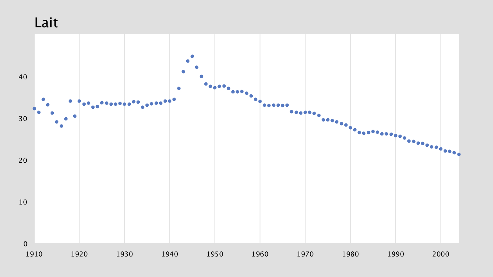

La fonction `floor()` permet d'éviter l'affichage de valeurs telles que *0.0*, *10.0*, etc. On aurai aussi pu utiliser la fonction `nf()` qui formate un nombre flottant sur un nombre de chiffres décimaux si ces derniers sont nécessaires.

notez aussi le centrage vertical du texte. Malheureusement le résultat n'est pas très satisfaisant :

* La valeur *0* est trop proche de l'année *1910*. 
* La valeur max de l'intervalle n’apparaît pas.
* Il n'y a pas de grille ou d'indicateurs pour mieux appréhender les valeurs.

Une première amélioration donc, consiste à dessiner les valeurs min et max avec un alignement spécifique :

```java
void dessineAxeVolume() {
    fill(0);
    textSize(10);
    for(float v = dmin; v <= dmax; v+=intervalleVolume) {
        float y = map(v, dmin, dmax, traceY2, traceY1);
        if(v == dmin) {
            textAlign(RIGHT, BOTTOM);
        } else if(v == dmax) {
            textAlign(RIGHT, TOP);
        } else {
            textAlign(RIGHT, CENTER);
        }
        text(floor(v), traceX1 - 10, y);
    }
}
```

Des lignes horizontales peuvent être ajoutées de la même façon que pour les années. Cependant il est important de se demander ce que l'on cherche à comparer dans ce diagramme. Ici l'évolution année par année est plus importante, et donc il n'est pas forcément nécessaire d'ajouter cette information qui va peut-être rendre le diagramme encombré. Il est alors possible de dessiner seulement des tirets le long du diagramme. Pour rendre cela plus utile encore, nous allons dessiner des tirets majeurs et mineurs.

```java
int intervalleVolumeMineur = 5; // ajoutez ceci avant setup().

void dessineAxeVolume() {
    fill(0);
    textSize(10);
    stroke(128);
    strokeWeight(1);

    for(float v = dmin; v <= dmax; v+=intervalleVolumeMineur) {
        if(v % intervalleVolumeMineur == 0) {
            float y = map(v, dmin, dmax, traceY2, traceY1);
            if(v % intervalleVolume == 0) {
                if(v == dmin) {
                    textAlign(RIGHT, BOTTOM);
                } else if(v == dmax) {
                    textAlign(RIGHT, TOP);
                } else {
                    textAlign(RIGHT, CENTER);
                }
                text(floor(v), traceX1 - 10, y);
                line(traceX1 - 4, y, traceX1, y); // Tiret majeur.
            } else {
                line(traceX1 - 2, y, traceX1, y); // Tiret mineur.
            }
        }
    }
}
```

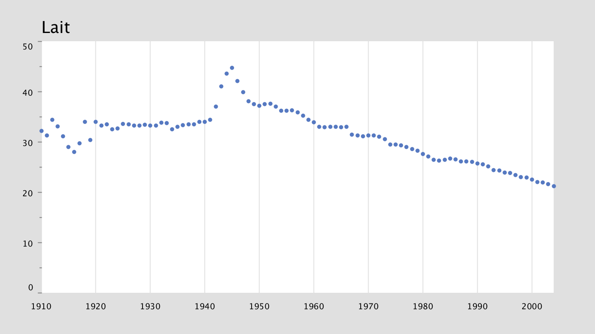

## Finaliser le diagramme

Le diagramme devient lisible, quelqu'un qui le découvrirait voit qu'on parle certainement de l'évolution de quelque-chose sur le lait entre 1910 et légèrement après 2000. Cependant il est essentiel de fournir une indication exacte de ce qui doit y être lu.

**Exercice 3.2** Ajoutez la légende "Année" sur l'axe des X et "Litres consommés par pers." sur l'axe des Y. Vous aurez besoin de décaler le diagramme pour faire suffisamment de place à gauche pour l'axe des Y. Aussi Sachez qu'il est tout à fait autorisé d'ajouter des caractères `\n` de retour à la ligne dans une chaîne de texte dessinée avec `text()`.

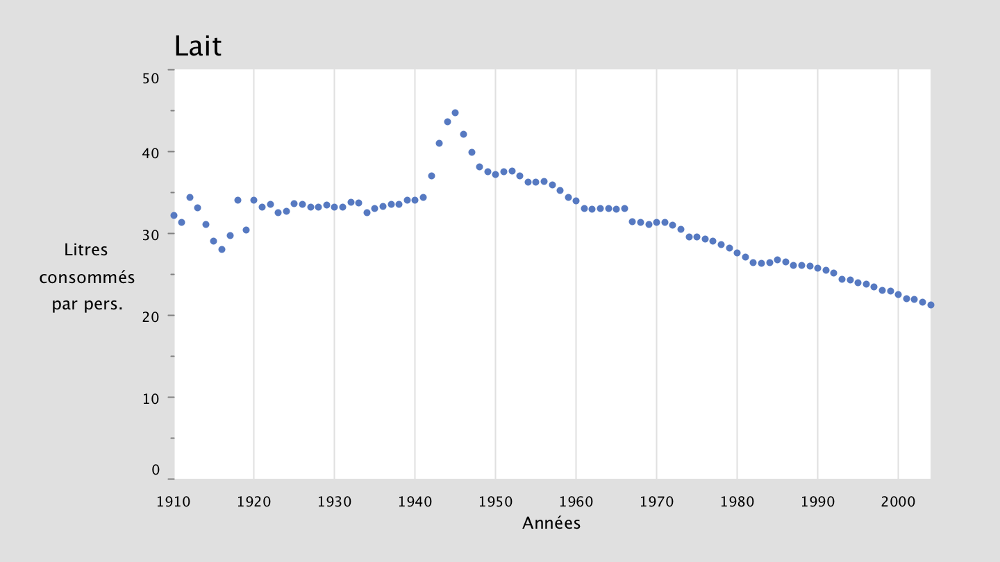

## Choisir une représentation appropriée (Représenter et affiner)

Une série de points peut être difficile à suivre s'ils ne sont pas connectés. C'est le cas avec le café dans notre exemple. 

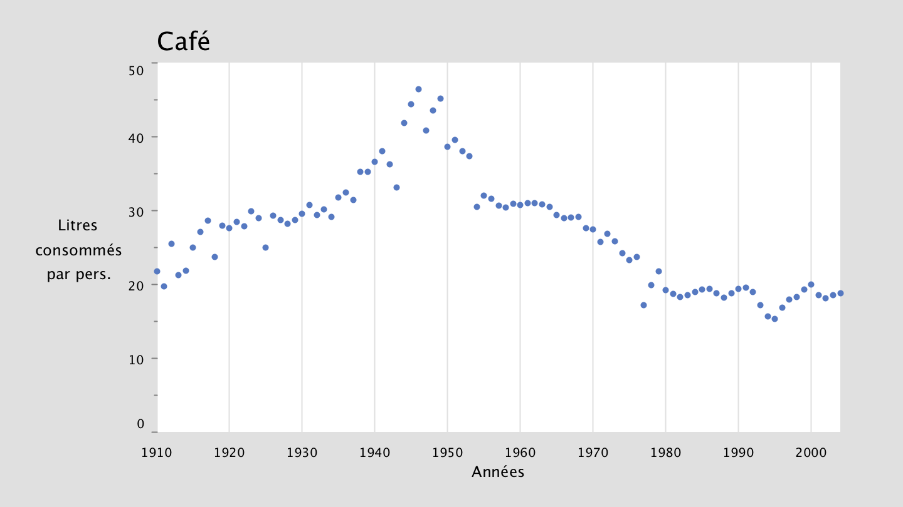

Quand les valeurs représentent réellement une série et qu'il n'y a pas de manque dans les données, connecter les points rend souvent les choses plus lisibles. Les commandes `beginShape()` et `endShape()` fournissent un bon moyen de réaliser cela. La méthode `vertex()` ajoute un point dans une forme, il nous suffirait dont d'utiliser `vertex()` à la place de `point()`.

Voici trois exemples d'utilisation :

```java
noFill();
beginShape();
vertex(10, 10);
vertex(90, 30);
vertex(40, 90);
vertex(50, 40);
endShape();
```

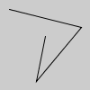

```java
beginShape();
vertex(10, 10);
vertex(90, 30);
vertex(40, 90);
vertex(50, 40);
endShape();
```

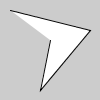

```java
beginShape();
vertex(10, 10);
vertex(90, 30);
vertex(40, 90);
vertex(50, 40);
endShape(CLOSE);
```

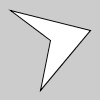

Ici il serait intéressant de réaliser une ligne sans remplissage :

```java
void dessineLigneDonnees(int col) {
    beginShape();   // On commence la ligne.
    strokeWeight(5);
    stroke(#5679C1);
    noFill();
    int lignes = donnees.getRowCount();
    for(int ligne = 0; ligne < lignes; ligne++) {
        if(donnees.isValid(ligne, col)) {
            float valeur = donnees.getFloat(ligne, col);
            float x = map(annees[ligne], amin, amax, traceX1, traceX2);
            float y = map(valeur, dmin, dmax, traceY2, traceY1);
            //point(x, y);
            vertex(x, y);
        }
    }
    endShape(); // On termine la ligne sans fermer la forme.
}
```

Et bien sûr changer `draw()` avec la nouvelle fonction de dessin.

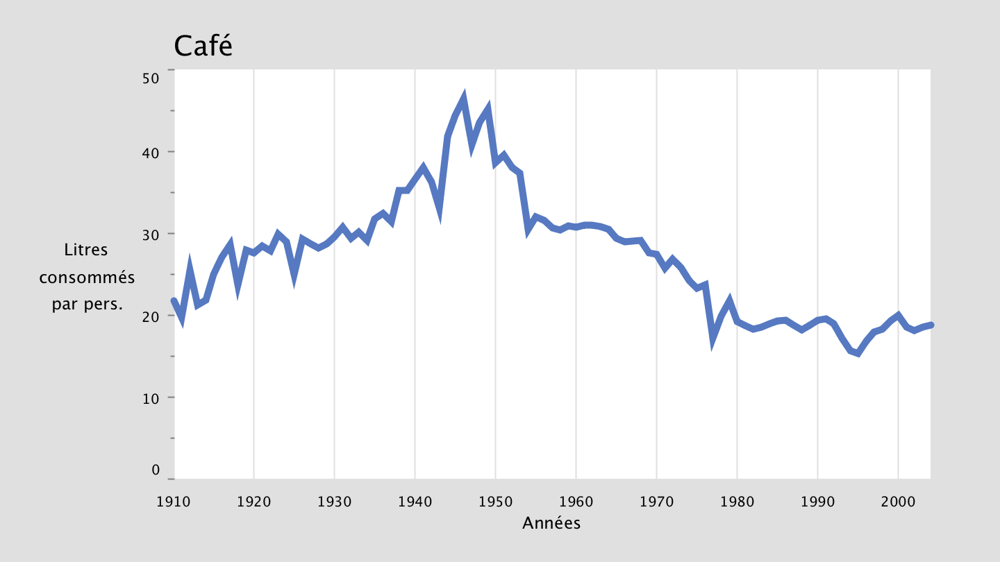

Jusqu'à présent nous avons placés les commandes `fill()` `stroke()` etc. dans les fonctions de dessin. C'est pratique mais il est souvent plus utile de les placer à l'extérieur. La raison principale est la modularité et la réutilisation. En effet, on pourrait vouloir superposer les courbes du lait, thé et café. Dans ce cas il serait intéressant de leur attribuer des couleurs distinctes. Une alternative serait de dessiner à la fois une ligne pour mieux suivre les données, mais aussi des points individuels  Pour ce faire le mieux est de sortir les informations de *style* de la fonction de dessin et de s'en occuper avant l'appel à la procédure de dessin.

On pourrait modifier `draw()` ainsi :

```java
void draw() {
    background(224);

    // Dessine le fond.
    fill(255);
    rectMode(CORNERS);
    noStroke();
    rect(traceX1, traceY1, traceX2, traceY2);
    
    dessineTitre();
    dessineAxeAnnees();
    dessineAxeVolume();

    strokeWeight(1);
    stroke(#5679C1);
    noFill();
    dessineLigneDonnees(colonne);
    strokeWeight(5);
    stroke(#5679C1);
    dessinePointsDonnees(colonne);
}
```

et retirer toute commande `strokeWeight()`, `stroke()` et `noFill()` de nos méthodes de dessin.

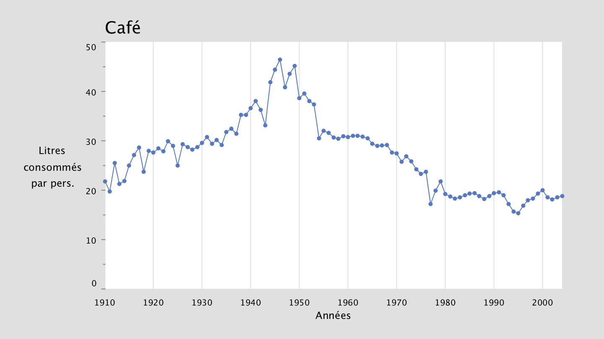

**Exercice 3.3** Réalisez un affiche de le diagramme sous la forme d'une aire en coloriant tout ce qui est sous la courbe. Assurez-vous que les lignes de grille sont encore visibles.

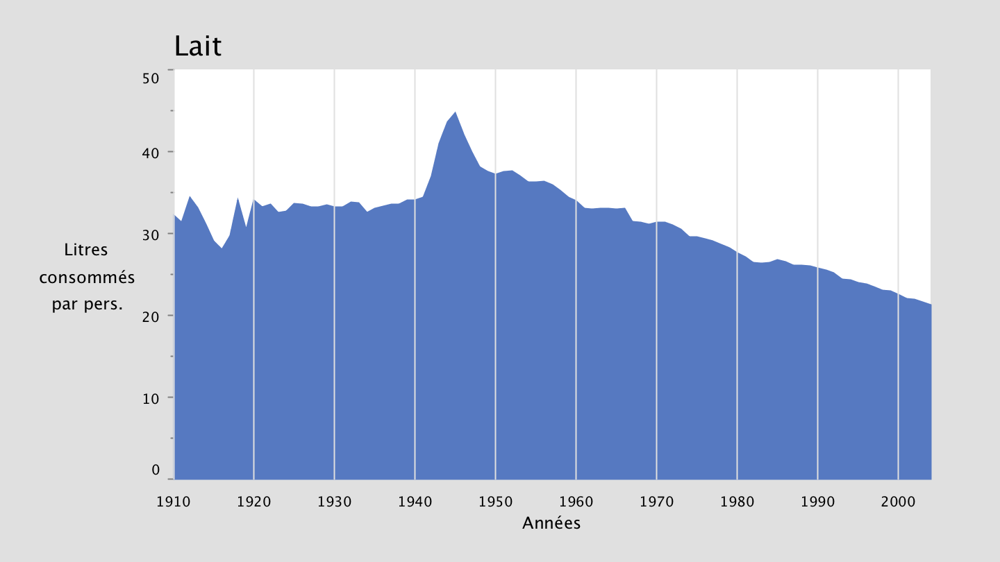

**Exercice 3.4** Réalisez le diagramme sous la forme d'un histogramme. Vous aurez besoin de reprendre la procédure de dessin des points. La commande `rect()` vous sera nécessaire.

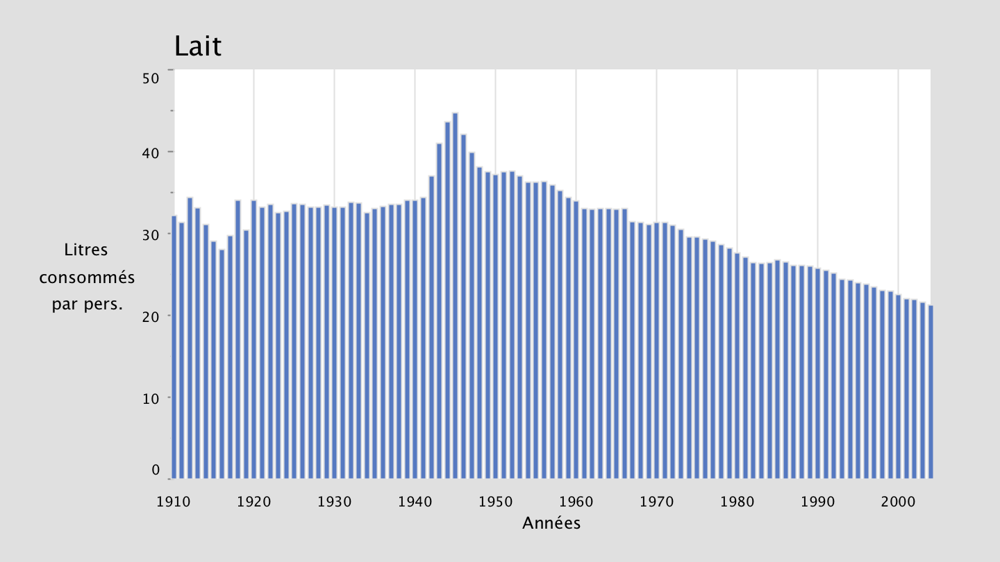

**Exercice 3.5, À rendre** Lorsqu'on passe d'une courbe à l'autre, les courbes changent sans transition. Cela rend leur comparaison difficile. Utilisez la classe `Integrator` que nous avons déjà utilisé au cours 2 pour réaliser une transition fluide entre les courbes. Notez que le nombre de points de chaque courbe est bien entendu le même. Vous aurez certainement besoin de régler l'attraction des `Integrator` à *0.1* ou *0.2* sous peine de voir leur comportement de "ressort" apparaître. Faites en sorte de choisir le mode d'affichage (ligne, histogramme, aire) en appuyant sur n'importe quelle touche du clavier.

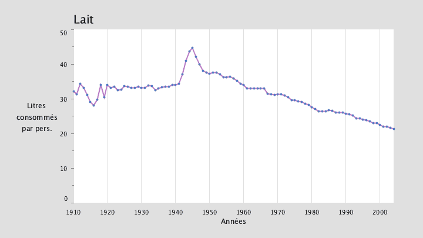

