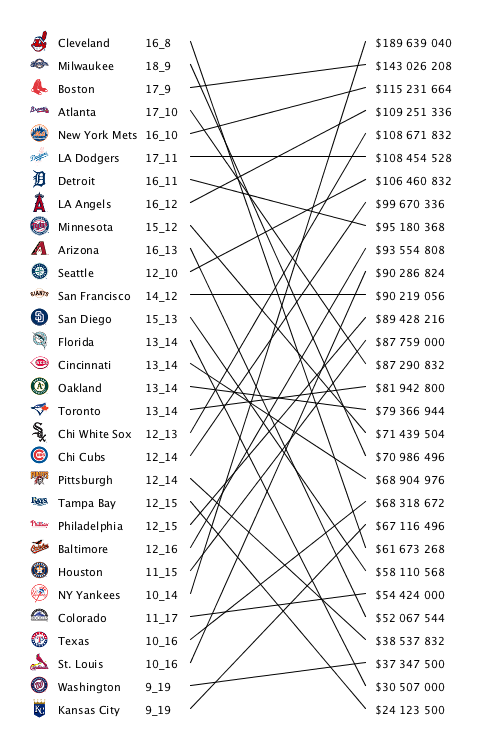
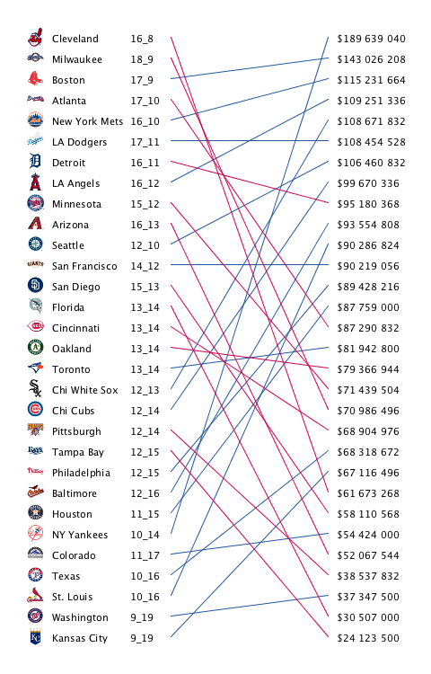
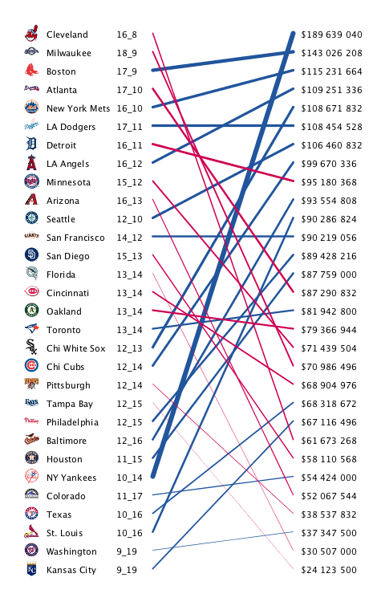
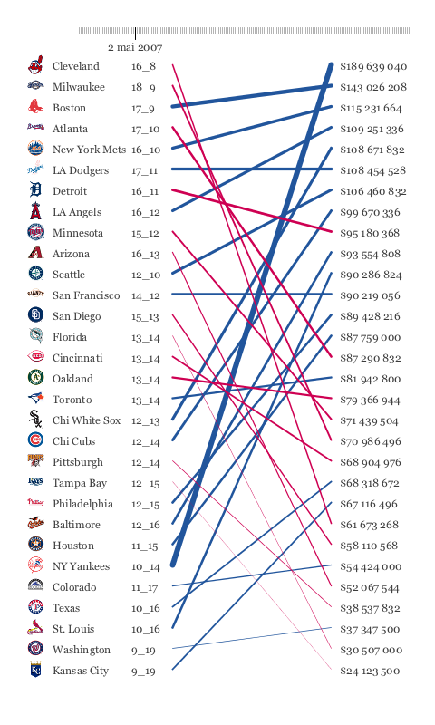

# Connections et corrélations

Les données qui varient à travers plusieurs dimensions sont communes, et il est difficile de les représenter sur des diagrammes traditionnels exploitant les deux dimensions de l'écran. En particulier on a souvent une variable indépendante et une variable liée qui changent au cours du temps. De nombreuses techniques existent pour représenter le changement, parmi lesquelles l'*animation* est une des plus appréciées.

Dans ce cours nous allons réaliser un affichage des résultats de baseball pour explorer comment les relations peuvent être instantanément figurées grâce à la disposition spatiale des données, les éléments visuels tels que de simples lignes ou des icônes, et l'animation. 

Bien entendu, il n'est pas nécessaire de connaître le baseball pour suivre ce chapitre, il se concentre plus sur les données que le jeu lui-même. L'une des difficultés majeures de l'exercice n'est pas visible ici, il s'agit de l'acquisition des données. C'est en général en traversant des fichiers HTML, des feuilles de calcul de tableur ou des sources de données disponibles à travers des API web que l'on obtient ces données. Ici nous les aurons déjà sous forme de fichier `.tsv`.

## Le problème

En 2004, les Boston Red Sox ont gagné les World Series après 86 ans de défaites d'affilée. Pourtant les Red Sox sont la deuxième équipe la mieux payée en baseball. On peut alors se poser la question des relations entre le salaire et la performance des équipes individuelles.

## Les données 

Ici nous ne réaliserons donc pas toute la phase, délicate et laborieuse, permettant de retrouver les données. Ces dernières se trouvent sur plusieurs sites, ces derniers sont susceptibles de changer, et les données sont souvent peu structurées, ou d'une manière qui ne nous est pas pratique.

Nous aurons donc des données pré-traitées, pour les noms des équipes et leurs abréviations :

[equipes.tsv](equipes.tsv)

pour les salaires :

[salaires.tsv](salaires.tsv)

Enfin, afin de rendre l'affichage plus intéressant, nous aurons aussi une liste d'icônes pour chaque équipe :

[small.zip](small.zip)

## Utiliser les données pré-traitées (acquérir, analyser, filtrer et miner) 

Nous allons lire les fichiers de données et leur apporter une structure. Cependant, cette-fois nous n'utiliserons pas les classes `Table` ou `FloatTable`...

### Les noms d'équipes et les codes

De ce fait, la procédure d'initialisation étant plus complexe, nous allons décomposer cette dernière en plusieurs sous-fonctions. Dans `setupEquipes()` nous chargeons un fichier ligne par ligne avec `loadStrings()` et nous l'analysons avec `split()`. C'est un travail similaire que réalisait `Table` :

```java
int nequipes = 30;
String[] noms;
String[] codes;
HashMap indices;

void setupEquipes() {
  String[] lignes = loadStrings("equipes.tsv");
  nequipes = lignes.length;
  codes = new String[nequipes];
  noms = new String[nequipes];
  indices = new HashMap();
  
  for(int i = 0; i < nequipes; i++) {
    String[] parties = split(lignes[i], TAB);
    codes[i] = parties[0];
    noms[i] = parties[1];
    indices.put(codes[i], Integer.valueOf(i));
  }
}

int indexEquipe(String code) {
  return ((Integer) indices.get(code)).intValue();
}
```

L'ordre dans lequel les noms apparaissent et les salaires que nous lirons par la suite, ou les classements qui changeront au jour le jour, n'est pas forcément le même. Afin de le retrouver, nous mettons en place une table de correspondance entre les codes des équipes et leur indice. Nous pourrons ensuite travailler avec les codes. Chaque code pointe sur un indice entre 0 et 29. La fonction `indexEquipe()` permet d'accéder à cette association.

### Les salaires

Nous allons organiser les données de salaire en une liste triée de valeurs, tout comme les classements. Nous allons utiliser une classe pour effectuer ces classements, et cette fois ce sera une classe *Java*, car nous allons utiliser l'héritage pour l'étendre :

[RankedList.java](RankedList.java)

Ajoutez ce fichier au croquis, puis dans un nouvel onglet créez la classe `ListeSalaires` :

```java
class ListeSalaires extends RankedList {
  ListeSalaires(String[] lignes) {
    super(nequipes, false);
    
    for(int i=0; i<nequipes; i++) {
      String parties[] = split(lignes[i], TAB);
      // La première colonne est le code équipe :
      int index = indexEquipe(parties[0]);
      // La seconde colonne est le salaire :
      value[index] = parseInt(parties[1]);
      // On crée une valeur d'affichage au format $NN,NNN,NNN
      // (en anglais les grands nombres sont découpés par des virgules).
      int salaire = (int) value[index];
      title[index] = "$" + nfc(salaire);
    }
    update();
  }
}
```

Ce code a pour but principal de convertir les données du fichier `.tsv` qui sont dans un format spécifique à la façon dont `RankedList` les utilise. La classe `RankedList` contient à la fois les données (`value`), mais aussi la même liste avec des valeurs qu'on qualifie "d'affichage" (`title`) afin de présenter les données formatées aux utilisateurs, ainsi qu'un tableau de classement des données qui est mis à jour avec `update()`. L'ordre ici est décroissant d'où le paramètre `false` passé au super-constructeur. 

Enfin, dans l'onglet principal nous pouvons ajouter :

```java
ListeSalaires salaires;

void setupSalaires() {
    salaires = new ListeSalaires(loadStrings("salaires.tsv"));
}
```

### Les classements

Les classements sont traités de façon similaire. Cependant le principe ici est que ces classements vont changer tous les jours. Nous chargerons donc un nouveau fichier chaque jour. D'abord, une version modifiée du code de lecture ci-dessus est utilisée pour charger les classements du jour :

```java
String[] chargerClassements(int annee, int mois, int jour) {
    String nom = annee + nf(mois, 2) + nf(jour, 2) + ".tsv";
    String chemin = dataPath(nom);
    File fichier = new File(chemin);
    if((!fichier.exists()) || (fichier.length() == 0)) {
        // Si le fichier n'existe pas, on le crée à partir de données en ligne.
        // Attention pour cet exemple les années possibles sont entre 1999 et
        // 2011...
        println("on télécharge " + nom);
        PrintWriter writer = createWriter(chemin);
        String base = "http://mlb.mlb.com/components/game" +
           "/year_" + annee + "/month_" + nf(mois, 2) + "/day_" + nf(jour, 2) + "/";
        // American League
        lireClassements(base + "standings_rs_ale.js", writer);
        lireClassements(base + "standings_rs_alc.js", writer);
        lireClassements(base + "standings_rs_alw.js", writer);
        // National League
        lireClassements(base + "standings_rs_nle.js", writer);
        lireClassements(base + "standings_rs_nlc.js", writer);
        lireClassements(base + "standings_rs_nlw.js", writer);

        writer.flush();
        writer.close();
    }
    return loadStrings(chemin);
}

void lireClassements(String fichier, PrintWriter writer) {
    String[] lignes = loadStrings(fichier);
    String code = "";
    int wins = 0;
    int losses = 0;
    for(int i=0; i < lignes.length; i++) {
        String[] matches = match(lignes[i], "\\s+([\\w\\d]+):\\s'(.*)',?");
        if(matches != null) {
            String attr = matches[1];
            String valeur =  matches[2];

            if(attr.equals("code")) {
                code = valeur;
            } else if( attr.equals("w")) {
                wins = parseInt(valeur);
            } else if(attr.equals("l")) {
                losses = parseInt(valeur);
            }
        } else {
            if(lignes[i].startsWith("}")) {
                // Fin du groupe on écrit les valeurs.
                writer.println(code + TAB + wins + TAB + losses);
            }
        }
    }
}
```

Ce code est singulièrement plus compliqué, mais très utile. Soit un fichier de classement pour l'année, le mois et le jour donnés existe et il est chargé, sinon ce fichier est créé en téléchargeant les données sur le site *mlb.mlb.com*. L'accès aux données de ce site à singulièrement été rendu plus délicat et des données sont téléchargeables uniquement pour les années 1999 à 2011. Mais cela suffira pour notre exemple. Les fichiers recherchés ou créés ont la forme `20070502.tsv` par exemple pour le 2 mai 2007.

Ce code nous apprend aussi comment télécharger les données et les analyser à partir d'Internet. Enfin il nous apprend à créer facilement un fichier `.tlv` correspondant. La grande difficulté en général dans cet exercice consiste à connaître et analyser les données provenant d'Internet, souvent sans documentation. Ici ce travail est déjà réalisé. Qui plus est, comme c'est le cas ici, les sites fournissant ces données peuvent en changer l'accès ou le format sans prévenir.

Notez l'utilisation de `dataPath()` qui à partir du nom du fichier retrouve le chemin complet en complétant avec celui du croquis. Cela nous permet d'utiliser la classe de Java `File` qui n'a aucune connaissance implicite des fichiers gérés par Processing.

Il nous reste à lire ces données, de la même façon que nous avons lu les salaires, dans un onglet séparé nommé `ListeClassements` :

```java
class ListeClassements extends RankedList {
    ListeClassements(String[] lignes) {
        super(nequipes, false);
        for(int i=0; i<nequipes; i++) {
            String[] parties = split(lignes[i], TAB);
            int index = indexEquipe(parties[0]);
            int wins = parseInt(parties[1]);
            int losses = parseInt(parties[2]);
            value[index] = (float) wins / (float) (wins+losses);
            title[index] = wins + "_" + losses;
        }
        update();
    }
}
```

et de la même façon, on initialise ces données dans l'onglet principal :

```java
ListeClassements classements;

void setupClassements() {
    classements = new ListeClassements(chargerClassements(2007, 5, 2));
}
```

### Les logos

Les logos sont stockés dans une archive nommée `small.zip`, désarchivez là et placez le répertoire `small` obtenu dans le répertoire `data`. Cette fois, il est plus facile de faire cette opération *à la main* avec un terminal ou un gestionnaire de fichiers.

Ensuite le chargement des logos est facile :

```java
PImage[] logos;
float logow;
float logoh;

void setupLogos() {
    logos = new PImage[nequipes];
    for(int i=0; i<nequipes; i++) {
        logos[i] = loadImage("small/" + codes[i] + ".gif");
    }
    logow = logos[0].width / 2.0;
    logoh = logos[0].height / 2.0;
}
```

Par défaut les logos donnés ici font 38 pixels de large sur 45 de haut. Il y a 30 équipes, nous disposerons les logos de haut en bas, cela fait 45*30, soit 1350 pixels de haut, ce qui peut être beaucoup. Nous divisons donc les hauteurs et largeurs par deux.

### Fin du setup

Nous pouvons enfin finaliser le `setup()` :

```java
PFont font;

void setup() {
    size(480, 750);

    setupEquipes();
    setupSalaires();
    setupClassements();
    setupLogos();

    font = createFont("SansSerif", 11);
    textFont(font);
}
```

Rien de graphique n’apparaîtra, mais il est bon de tester votre code. La ligne "on télécharge 20070502.tsv" devrait apparaître sur la console, et le fichier correspondant devrait être créé. *Vérifiez si son contenu est cohérent !*

## Afficher les résultats (représenter)

Avec ce que nous avons collecté précédemment, nous pouvons commencer à penser à représenter nos données. Nous avons deux colonnes de données : les scores et les salaires, ainsi que des logos pour agrémenter l'affichage. 

Il semblerait assez direct, avec deux colonnes, et donc deux variables importantes (scores et salaires), d'utiliser les axes X et Y. Mais la *question* que l'on se pose ici n'est pas simplement "*est-ce que les scores et les salaires sont corrélés ?*", et donc un affichage par points en XY n'est pas des plus indiqués.

Notre question implique un classement, car nous comparons les équipes, et les classements se font usuellement en liste. Nous allons donc commencer par classer les deux listes en ordre décroissant, et ensuite nous *connecterons* chaque score d'une équipe avec son salaire par une ligne. La partie importante de cet affichage n'en seront donc pas les listes, mais bien les *lignes de connexion*.

Tout le reste de ce cours se portera, une fois cet affichage de base réalisé, sur la façon dont nous pouvons rendre les choses plus lisibles et compréhensibles grâce à ces connexions.

```java
static final int HLIGNE = 23;
static final float DEMI_HLIGNE = HLIGNE / 2.0;
static final int BORDS = 30;

void draw() {
  background(255);
  smooth();
  translate(BORDS, BORDS);
  float gaucheX = 160;
  float droiteX = 335;
  textAlign(LEFT, CENTER);
  for(int i=0; i<nequipes; i++) {
    fill(0);
    float classementY = classements.getRank(i) * HLIGNE + DEMI_HLIGNE;
    image(logos[i], 0, classementY - logoh/2, logow, logoh);
    text(noms[i], 28, classementY);
    text(classements.getTitle(i), 115, classementY);
    float salaireY = salaires.getRank(i) * HLIGNE + DEMI_HLIGNE;
    stroke(0);
    line(gaucheX, classementY, droiteX, salaireY);
    text(salaires.getTitle(i), droiteX + 10, salaireY);
  }
  
}
```



La commande `translate()` est nouvelle ici. Elle transporte l'origine `(0,0)` en `(30, 30)`. Cela nous donne un léger espace à gauche et en haut qui sera laissé vide. Les valeurs de `BORDS`, `gaucheX` (position de départ en X à gauche) et `droiteX` (idem à droite), sont déterminées par essai-erreur, mais une technique permettant de trouver les valeurs max des colonnes serait à prévoir !

Nous pouvons commencer à analyser les données un peu plus facilement avec cette représentation. On constate par exemple que les *Boston Red Sox* sont payés correctement au vu de leurs résultats (ils sont en haut du classement) et une ligne assez horizontale part vers leur salaire. En revanche, les *New York Yankees* sont classés très bas pour leur salaire : Une ligne diagonale traverse le diagramme. Et l'équipe de *Cleveland* est très peu rémunérée alors que son résultat est parmi les meilleurs résultats.

## Affiner l'affichage

Si on regarde bien, une ligne dont la pente monte de gauche à droite, indique qu'une équipe gagne un bon salaire pour des résultats moins bons, et inversement pour une ligne dont la pente descend. C'est la question basique que l'on peut se poser avec un tel affichage : l'équipe dépense-t-elle bien ses recettes ? Et la réponse étant oui ou non, un choix de couleur pourrait nous aider.

**Exercice 4.1** Assurez vous que les lignes sont en bleu pour les équipes qui dépensent mal leurs recettes, et en rouge sinon.



Mais nous pourrions rendre l'affichage encore plus informatif, en montrant l'importance des salaires des équipes. Pour cela, nous pourrions par exemple faire varier l'épaisseur des lignes en fonction de l'importance du salaire.

**Exercice 4.2** Assurez vous que les équipes qui touchent un salaire maximal ont des lignes d'épaisseur importante (disons 6 pixels), et inversement que les équipes qui touchent un salaire minimal ont des lignes d'épaisseur faible (disons *0.25* pixels). La fonction `map()`, une fois de plus, pourrait vous être très utile...



Notez comme les *New York Yankee* ressortent aussitôt.

**Exercice 4.3** Vous pouvez essayer de trouver une meilleure police de caractères afin de rendre l'affichage plus attrayant. Attention cependant, la version que nous utilisons ici nous donne des chiffres à espacement fixe, ce qui permet de les comparer plus facilement. Jouez aussi avec la couleur du texte pour le rendre moins proéminent.

## Rendre les choses interactives

**Exercice 4.4** **à rendre** Une saison de compétition de baseball commence début avril et se termine fin septembre. Assurez-vous d'afficher un sélecteur de jour permettant d'afficher chaque jour d'une saison de l'année 2007 sous la forme d'un tiret. Lorsque l'utilisateur clique sur le tiret d'un jour, les données de ce dernier sont affichées. La date en texte du jour doit aussi s'afficher sous le tiret correspondant.



La manipulation des dates est vite problématique si elle reste sous la forme jour-mois-année. Une meilleure option est d'utiliser les dates au format `long` sous la forme d'un nombre de millisecondes pour les stocker, puis de les transformer à nouveau en date standard avec la classe `DateFormat` ou `SimpleDateFormat` de Java ainsi que `Date` ensuite.

Par exemple, voici quelques fonctions utiles :

```java
// Créer un format de date.
DateFormat format = new SimpleDateFormat("yyyyMMdd");
// Lit une chaîne de caractères dans ce format et la convertit en objet Date.
Date date = format.parse("20070401");
// Obtient le nombre de millisecondes écoulées depuis le 1 janvier 1970 et la date.
Long time = date.getTime();
// Un autre format de date.
DateFormat joli = new SimpleDateFormat("d MMM yyyy");
// Prend un nombre de millisecondes et le formate.
println(joli.format(time));
```

Vous aurez aussi besoin d'importer ces classes, ajoutez au début du croquis :

```java
import java.text.*;
import java.util.*;
```

Attention `DateFormat.parse()` peut lancer une `ParseException` si le format en entrée est invalide, pensez à attraper cette exception avec un bloc `try` `catch`.

Voici un autre exemple qui permet de faire de l'arithmétique avec les dates en utilisant la classe `Calendar` : 

```java
DateFormat format = new SimpleDateFormat("yyyy/MM/dd HH:mm:ss");
Date date = new Date();
System.out.println(format.format(date));

Calendar c = Calendar.getInstance();
c.setTime(date);

c.add(Calendar.YEAR, 1);
c.add(Calendar.MONTH, 1);
c.add(Calendar.DATE, 1); // c.add(Calendar.DAY_OF_MONTH, 1);
c.add(Calendar.HOUR, 1);
c.add(Calendar.MINUTE, 1);
c.add(Calendar.SECOND, 1);

Date datePlusUn = c.getTime();

System.out.println(format.format(datePlusUn));
```

**Exercice 4.5** **à rendre** Le changement entre les jours est trop abrupt pour qu'une comparaison puisse se faire facilement. Utilisez la classe `Integrator` à nouveau pour introduire des transitions douces entre les positions des équipes et des salaires.
