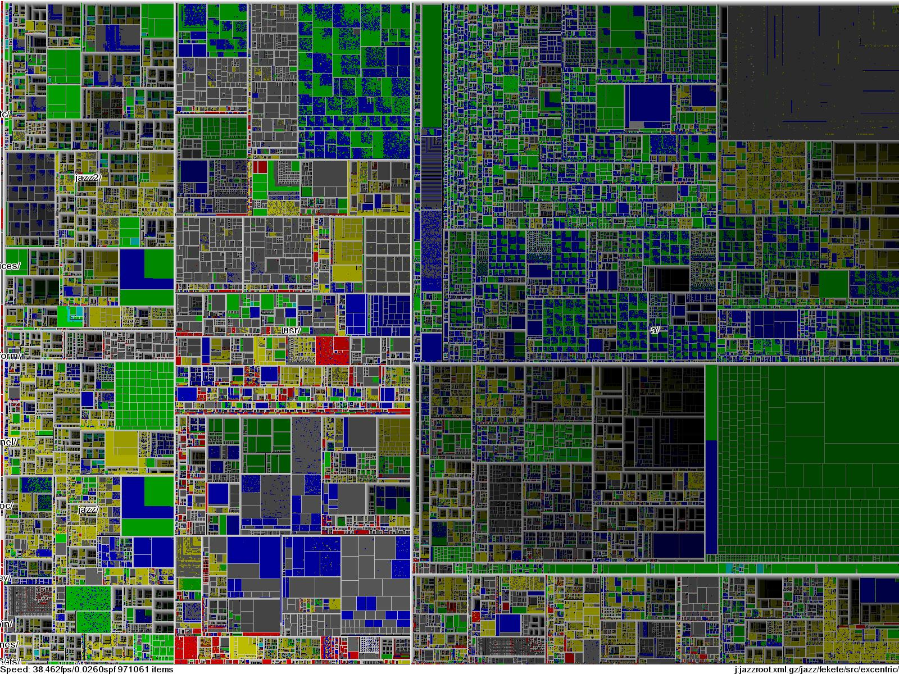
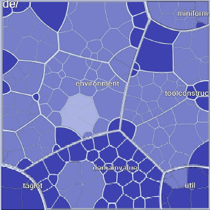
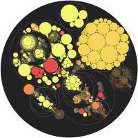
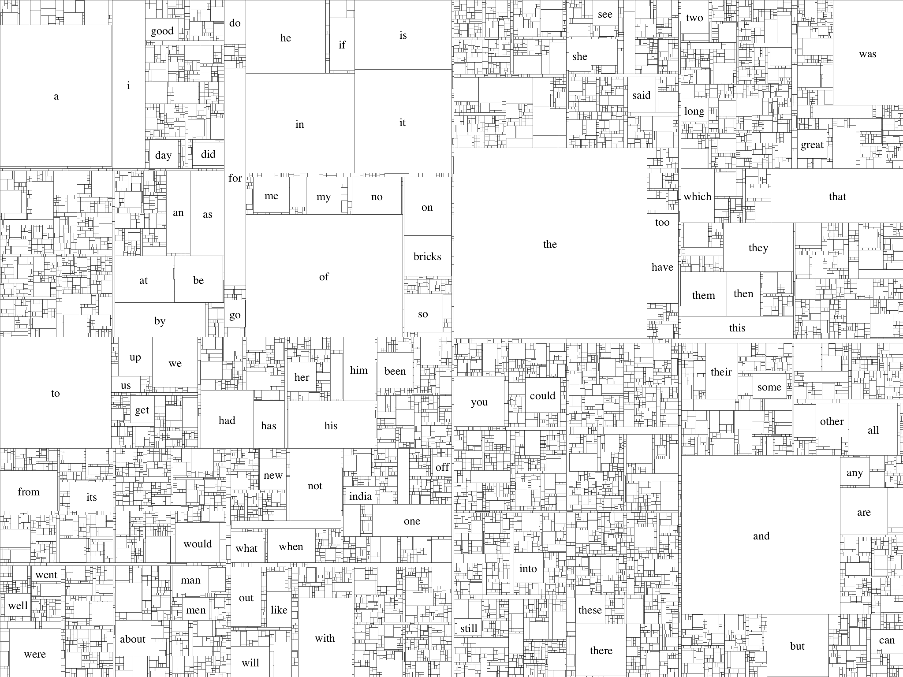
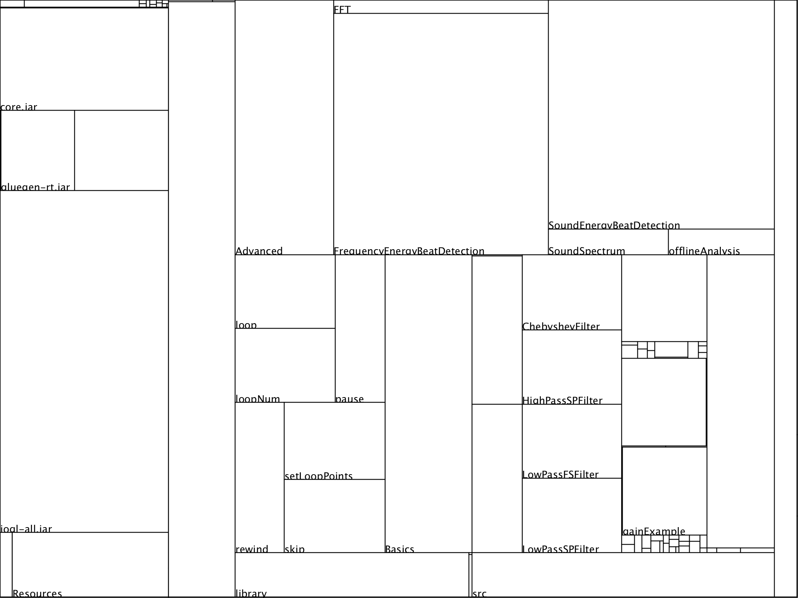
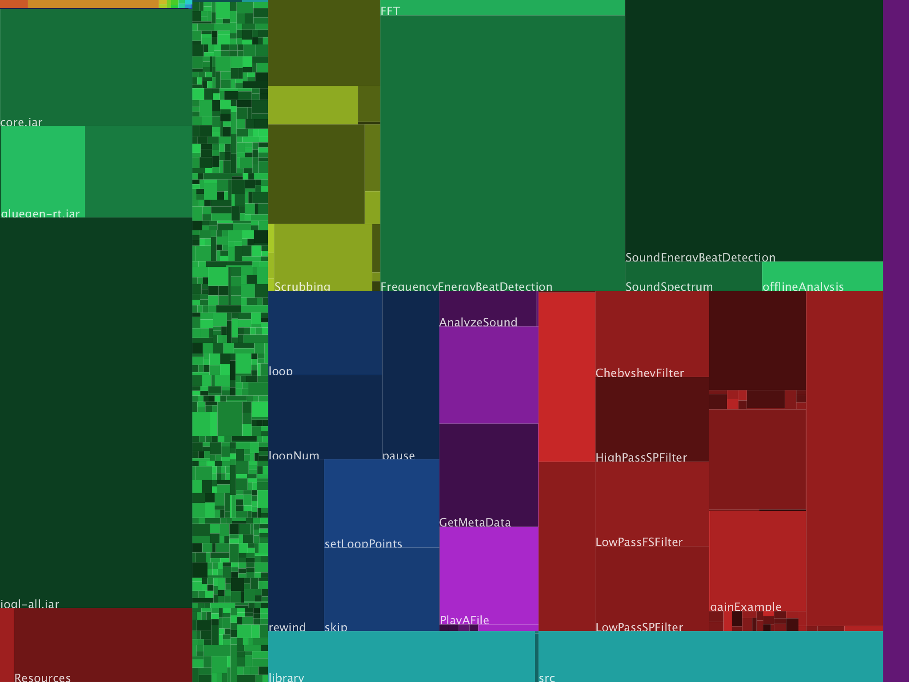

# Arbres, hiérarchies et récursion

Dans le cours précédent nous avons affiché des listes. Nous allons maintenant nous intéresser à des données hiérarchisées. Les structures arborescentes stockent des données pour lesquelles chaque élément peut avoir des sous-éléments. Les systèmes de fichiers sont souvent un bon exemple de structure hiérarchisée représentable sous forme d'arbres, constitués de nœuds et de sous-nœeuds.
Certains sous-nœuds sont des feuilles de l'arbre, dans le sens où ils ne peuvent pas contenir de sous-éléments. Dans notre exemple de système de fichiers, les fichiers sont des feuilles et les répertoires des nœuds.

La structure *récursive* de ces données les rend souvent un peu plus difficiles à gérer, mais ce type de données étant particulièrement répandu, nous allons voir une méthode efficace de représentation les concernant.

Nous aurons quelques petits défis à relever :

* En général les affichages hiérarchiques n'affichent pas tous les niveaux de la hiérarchie, et on laisse l'utilisateur interagir pour afficher plus de sous-niveaux.
* Cela implique qu'il faut signaler que certaines parties des données sont omises ou cachées.
* Les données hiérarchiques sont souvent volumineuses, et il est préférable de charger ces dernières de manière *incrémentale* que de laisser l'utilisateur attendre la fin du chargement.

## Utiliser la récursion pour construire une arborescence de répertoires

Avant de commencer la représentation graphique, nous devons travailler sur les structures de données que nous allons utiliser, c'est à dire la façon dont on va organiser nos données. 

Créez un nouveau croquis et ajoutez d'emblée un nouvel onglet que nous nommerons `Noeud`. La classe suivante représente un fichier du disque. Lors de sa création, on regarde l'objet `File` (de la bibliothèque standard de Java) correspondant. Si ce dernier est un répertoire, on crée récursivement des sous-nœuds correspondant, etc.

```java
class Noeud {
    File fichier;
    Noeud[] enfants;
    int nEnfants;

    Noeud(File fichier) {
        this.fichier = fichier;
        if(fichier.isDirectory()) {
            String[] contenus = fichier.list();
            enfants = new Noeud[contenus.length];
            for(int i=0; i<contenus.length; i++) {
-               enfants[nEnfants++] = new Noeud(new File(fichier, contenus[i]));
            }
        }
    }
}
```

## Problèmes courants avec les fichiers (filtrer)

Maintenant que vous avez compris ce code, nous ... n'allons pas l'utiliser ! En effet, comme pour les données en général, il nous faut appliquer un filtre et vérifier les valeurs.

Par exemple, sur les systèmes dérivés d'Unix (Linux et MacOs par exemple), la commande `fichier.list()` nous retournera des fichiers `.` et `..` qui pourraient produire une boucle infinie. C'est la raison pour laquelle nous utilisons un champ `nEnfants` plutôt que d'utiliser le champ `length` de `enfants`. 

De plus, la commande `fichier.list()` peut nous retourner une valeur `null` si un fichier n'est pas accessible pour des raisons de droits insuffisants ou une erreur de lecture. 

Un autre problème peut se produire sur les systèmes unixiens : les liens symboliques peuvent nous enfermer à nouveau dans une boucle. La méthode `getCanonicalPath()` de `File` nous permet de retrouver l'emplacement réel d'un fichier. 

Enfin, il sera certainement intéressant de trier la liste des fichiers retrouvée qui sinon est retournée dans un ordre quelconque.

## Afficher récursivement une arborescence de fichiers (représenter)

Notre implantation initiale fournira aussi comme option d'afficher sur la console l’arborescence des fichiers :

```java
class Noeud {
    File fichier;
    Noeud[] enfants;
    int nEnfants;

    Noeud(File fichier) {
        this.fichier = fichier;

        if(fichier.isDirectory()) {
            String[] contenus = fichier.list();
            if(contenus != null) {
                // Trie les fichiers dans ordre insensible à la case.
                contenus = sort(contenus);

                enfants = new Noeud[contenus.length];
                for(int i=0; i<contenus.length; i++) {
                    if(contenus[i].equals(".") || contenus[i].equals("..")) {
                        continue;
                    }
                    File enfant = new File(fichier, contenus[i]);
                    try {
                        String cheminAbs = enfant.getAbsolutePath();
                        String cheminCan = enfant.getCanonicalPath();
                        if(!cheminAbs.equals(cheminCan)) {
                            continue;
                        }
                    } catch (IOException e) { }
                    enfants[nEnfants++] = new Noeud(enfant);
                }
            }
        }
    }


    void printList() {
        printList(0);
    }

    void printList(int profondeur) {
        for(int i=0; i<profondeur; i++) print(" ");
        println(fichier.getName());
        for(int i=0; i<nEnfants; i++) enfants[i].printList(profondeur+1);
    }
}
```

De retour dans l'onglet principal, Quelques lignes de code nous seront utiles pour afficher et créer une arborescence :

```java
void setup() {
    Noeud racine = new Noeud(new File("/Users/bob/Documents/Processing"));
    racine.printList();
}
```

## Utiliser une queue pour le chargement asynchrone (interagir)

L'un des problèmes avec le chargement récursif des répertoires est que la création du nœud initial ne se termine pas tant que tous les sous-répertoires sont explorés. Si on considère une arborescence large, cela peut prendre un certain temps, pendant lequel le programme se figera, ce qui n'est pas une situation acceptable pour un programme interactif.

Plutôt que de créer l'arbre entier instantanément, une meilleure approche consiste à utiliser une *queue*. Chaque fois qu'un répertoire est trouvé, il est ajouté dans une liste, et au fur et à mesure que `draw()` s'exécute, quelques éléments supplémentaires de la queue peuvent être lus. Ainsi, le programme ne se fige pas, et la progression de la lecture peut être affichée.

Afin de mettre cela en œuvre, nous réutiliserons à nouveau le code précédent : la queue sera gérée en mémorisant une liste d'objets de type `Noeud` qui n'ont pas encore été scannés. Nous gérerons cette liste dans l'onglet principal du croquis :

```java
Noeud[] rep = new Noeud[10];
int nrep;
int repIndex;
```

L'entier `nrep` compte le nombre de répertoires dans la liste `rep`. L'entier `repIndex` permet de suivre le répertoire courant à lire. Nous allons aussi ajouter des fonctions dans l'onglet principal : `ajoutRepertoire()` pour ajouter un répertoire à la liste, et `repertoireSuivant()` pour obtenir le répertoire suivant dans la liste :

```java
void ajoutRepertoire(Noeud repertoire) {
    if(nrep == rep.length) {
        rep = (Noeud[]) expand(rep);
    }
    rep[nrep++] = repertoire;
}

void repertoireSuivant() {
    if(repIndex != nrep) {
        Noeud n = rep[repIndex++];
        n.scanne();
    }
}
```

La fonction `expand()` de Processing double la taille d'un tableau en conservant son contenu et en ajoutant à la fin des cases libres. Il est possible d'ajouter un second paramètre à `expand()` pour donner le nouvelle taille du tableau.

La méthode `draw()` peut ensuite appeler `repertoireSuivant()` quand la visualisation est prête pour plus de données. Cette fonction appelle `scanne()` sur un objet `Noeud` (donnée par la suite), qui remplit la structure de `Noeud` avec l'information sur les sous-répertoires. Appeler `repertoireSuivant()` prend un temps négligeable comparé à la création complète de l'arborescence.

Techniquement notre implantation n'est pas réellement une queue, puisque les éléments ajoutés ne sont jamais retirés. Cependant, conserver la liste des répertoires nous sera utile par la suite : quand nous avons traversé la liste complète, nous pouvons ensuite la re-scanner pour chercher les changements. 

Notre implantation de `Noeud` change donc aussi. Le nouveau constructeur de `Noeud` utilise `ajoutRepertoire()` sur les répertoires, et le reste du code de l'ancien constructeur se retrouve dans la méthode `scanne()`, appelée par `repertoireSuivant()`.

```java
Noeud(File fichier) {
    this.fichier = fichier;
    if(fichier.isDirectory()) {
        ajoutRepertoire(this);
    }
}

void scanne() {
    String[] contenus = fichier.list();
    if(contenus != null) {
        contenus = sort(contenus);
        enfants = new Noeud[contenus.length];
        for(int i=0; i<contenus.length; i++) {
            if(contenus[i].equals(".") || contenus[i].equals("..")) {
                continue;
            }
            File enfant = new File(fichier, contenus[i]);
            try {
                String cheminAbs = enfant.getAbsolutePath();
                String cheminCan = enfant.getCanonicalPath();
                if(!cheminAbs.equals(cheminCan)) {
                    continue;
                }
            } catch (IOException e) { }
            enfants[nEnfants++] = new Noeud(enfant);
        }
    }
}
```

## Afficher la progression

Pour montrer la progression, il nous faut une police :

```java
void setup() {
    size(400, 130);
    Noeud racine = new Noeud(new File("/Users/antoine/Documents/Processing"));
    textFont(createFont("SansSerif", 11));
}
```

La méthode `draw()` gère le fond, et l'appel à `repertoireSuivant()` ainsi qu'à `statut()`, dont nous parlerons ensuite. Pour lire les répertoires plus vite, nous pouvons ajouter une boucle autour de `repertoireSuivant()` de façon à scanner plus de répertoires à chaque itération dans `draw()`. Avec 12000 répertoires et `draw()` dessinant à 60 images par seconde, il nous faudrait 200 secondes pour lire la hiérarchie. Une boucle `for` appelant `repertoireSuivant()` 10 fois par exécution de `draw()` réduit ce temps à 20 secondes, plus le temps nécessaire à `scanne()`. Quelques essais permettent de régler correctement ce nombre de tours idéal pour cette boucle, cela dépend de la machine. 

La méthode `statut()` dessine une barre de progression et nous informe sur l'avancée du processus de lecture :

```java
void statut() {
    float x = 30;
    float w = width - x*2;
    float y = 60;
    float h = 20;

    fill(0);
    if(repIndex != nrep) {
        text("Lecture du répertoire " + nfc(repIndex+1) + " sur " + nfc(nrep), x, y - 10);
    } else {
        text("Lecture terminée", x, y - 10);
    }

    fill(128);
    rect(x, y, w, h);
    float progres = map(repIndex+1, 0, nrep, 0, w);
    fill(255);
    rect(x, y, progres, h);
}
```

**Exercice 5.1** Écrivez la méthode `draw()`.

## Une introduction aux cartes arborescentes (treemaps)

Il n'est pas rare de chercher combien d'espace de stockage est utilisé sur une unité de stockage. Les gestionnaires de fichiers usuels ne sont pas très bons à cette tâche car leur rôle consiste surtout à nous montrer un répertoire individuel. Frustré par son disque dur perpétuellement plein, Ben Shneiderman, du laboratoire d'interaction humain-machine de l'Université du Maryland (HCIL, Human-Computer Interaction Laboratory) à créé un algorithme de subdivision de l'espace et de représentation des fichiers et répertoires pouvant l'aider. Il a nommé cette représentation *carte arborescente* ou *treemap*, elle a ensuite été réutilisée de nombreuses fois.



Un historique de cette représentation peut être trouvée sur son [site](http://www.cs.umd.edu/hcil/treemap-history/), ainsi que quelques jolies représentations alternatives :





Nous allons nous concentrer sur la représentation rectangulaire des cartes arborescentes, en la rendant interactive. Cependant, comme la création de la structure de données est au delà de ce que nous souhaitons faire dans ce cours, nous allons utiliser une bibliothèque pré-définie et nous concentrer sur la partie graphique. Cette bibliothèque est open-source et sous licence Mozilla Public Licence :

[treemap.zip](treemap.zip)

Décompressez cette bibliothèque et placez là dans un répertoire `treemap` à l'intérieur du répertoire `sketchbook/libraries/` de Processing. Redémarrez Processing pour qu'il prenne en compte la bibliothèque. Si tout s'est bien passé, dans le menu `Help → Library reference` la documentation de `treemap` devrait être disponible.

## Un exemple de carte arborescente simple

Pour se familiariser avec la bibliothèque nous allons créer un autre croquis et réaliser un exemple simple. Sélectionnez le menu `Sketch → Import Library → treemap`. Cela rend la librairie accessible et une ligne apparaît dans le croquis :

```java
import treemap.*;
```

Pour cet exemple, nous allons charger une liste de mots à partir d'un fichier et ensuite afficher l'usage relatif de chaque mot. Pour l'ensemble de données, nous allons utiliser les 200000 mots du romans de Mark Twain *Following the Equator* et écrire une application qui affiche l'importance relative de chacun de ces mots :

[equator.txt](equator.txt)

Ajoutez ce fichier au croquis, en vous assurant qu'il est bien dans le répertoire `data`.

Pour utiliser la bibliothèque `treemap` il faut à la base connaître trois classes. La classe `SimpleMapItem` modélise un élément d'une carte (ici un mot). `SimpleMapModel` est une liste de `SimpleMapItem`. Une troisième classe `Treemap` a pour rôle de convertir des objets `SimpleMapModel` en une projection 2D affichable.

Créez un onglet `Mot` avec le code suivant :

```java
class Mot extends SimpleMapItem {
    String mot;

    Mot(String mot) {
        this.mot = mot;
    }

    void draw() {
        fill(255);
        rect(x, y, w, h);
        fill(0);
        if(w > textWidth(mot) + 6) {
            if(h > textAscent() + 6) {
                textAlign(CENTER, CENTER);
                text(mot, x + w/2, y + h/2);
            }
        }
    }
}
```

Chaque `SimpleMapItem` fournit des valeurs `x`, `y`, `w` et `h` qui permettent de positionner et dimensionner un rectangle. La méthode `draw()` à implanter dessine l'item correspondant. Ici on se contente d'un rectangle blanc avec un texte en noir mais seulement si on a la place d'afficher le texte.

Créez un autre onglet nommé `CarteDesMots` :

```java
class CarteDesMots extends SimpleMapModel {
    HashMap mots;

    CarteDesMots() {
        mots = new HashMap();
    }

    void ajouter(String mot) {
        Mot item = (Mot) mots.get(mot);
        if(item == null) {
            item = new Mot(mot);
            mots.put(mot, item);
        }
        item.incrementSize();
    }

    void fin() {
        items = new Mot[mots.size()];
        mots.values().toArray(items);
    }
}
```

Cette classe comporte un ensemble de mots et les stocke dans une table associative : on associe à la chaîne de caractères du mot, une instance de `Mot`. Ensuite quand un mot est ajouté dans la carte, soit il n'a jamais été rencontré et on l'insère dans la table associative soit il est déjà connu et on se contente d'incrémenter sa taille (visuellement) et donc son importance. En effet, la table associative ne va stocker les mots qu'une et unique fois, le `incrementSize()` sert donc de compteur pour le nombre de fois où le mot a été trouvé.

Enfin, la méthode `fin` prend les données de la table associative, donc des mots et les stocke dans un tableau `items` propre à `SimpleMapModel`. C'est ce tableau qui servira à la création de la représentation visuelle.

Nous devons terminer ce programme par la partie `setup()` et `draw()` :

```java
import treemap.*;

Treemap carte;

void setup() {
    size(1024, 768);
    strokeWeight(0.25f);
    textFont(createFont("Serif", 13));

    CarteDesMots mots = new CarteDesMots();

    String[] lignes = loadStrings("equator.txt");
    for(int i=0; i<lignes.length; i++) {
        mots.ajouter(lignes[i]);
    }
    mots.fin();
    carte = new Treemap(mots, 0, 0, width, height);

    // On ne va dessiner la carte qu'une fois.
    noLoop();
}

void draw() {
    background(255);
    carte.draw();
}
```



Notez l'appel à `noLoop()`. Cette commande précise à Processing que la fonction `draw()` ne doit être exécutée qu'une seule fois. Notre contenu n'étant pas dynamique, cela ne sert à rien de l'afficher en boucle. Notez aussi l'utilisation de `strokeWeight()` avec des lignes moins épaisses qu'un pixel. Ceci n'est possible que parce que Processing utilise de l'anti-aliasing. Normalement cet anti-aliasing est activé via la commande `smooth()`. Mais c'est aussi la valeur par défaut. Attention cependant, tous les modes de rendu de Processing ne respectent pas forcément cette valeur par défaut.

Finalement, en quelques lignes de code, nous avons une représentation de 200000 mots. D'autres ensembles de données peuvent certainement facilement s'adapter à ce style de représentation. Notez que changer l'apparence du résultat consiste surtout à changer l'implantation de la méthode `draw()` de la classe `Mot`.

Dans la suite, nous allons nous intéresser à une extension plus sophistiquée de la bibliothèque `TreeMap`. 

## Quels fichiers prennent le plus d'espace sur un système de stockage ?

Revenons à notre question initiale. Nous avons désormais de quoi lire l'arborescence des fichiers et de quoi représenter cette structure hiérarchique sous la forme d'une carte arborescente. Nous pouvons désormais nous poser la question : "quels fichiers prennent le plus de place ?" et y répondre graphiquement.

Commencez un nouveau croquis et importez la bibliothèque `treemap`.

## Lire la structure des répertoires (acquérir, analyser, filtrer, miner, représenter)

Nous allons utiliser le code des deux exercices précédents. Commençons avec une classe `Fichier` étendant la classe `SimpleMapItem`. Placez ce code dans un onglet `Fichier`. Ce code est très similaire à celui de `Mot`. Sa fonction est simple : contenir un objet de type `File` et gérer le dessin de ce dernier. Les coordonnées `x`, `y`, `w` et `h` sont converties dans la fonction `calcBoite()` en "coins", ce qui nous sera plus pratique par la suite si nous voulons zoomer dans un sous-répertoire.

```java
class Fichier extends SimpleMapItem {
    Repertoire parent;
    File fichier;
    String nom;
    int niveau;

    float sp;
    float gauche, haut, droite, bas;

    Fichier(Repertoire parent, File fichier, int niveau, int ordre) {
        this.parent = parent;
        this.fichier = fichier;
        this.order = ordre;
        this.niveau = niveau;
        nom = fichier.getName();
        size = fichier.length();
    }

    void calcBoite() {
        gauche = x;
        haut = y;
        droite = x + w;
        bas = y + h;
    }

    void draw() {
        calcBoite();
        fill(255);
        rect(gauche, haut, droite, bas);
        if(assezGrand()) {
            dessineTitre();
        }
    }

    void dessineTitre() {
        fill(0);
        textAlign(LEFT);
        text(nom, gauche + sp, bas + sp);
    }

    boolean assezGrand() {
        float largeur = textWidth(nom) + sp*2;
        float hauteur = textAscent() + textDescent() + sp*2;
        return ((droite - gauche) > largeur) && ((bas-haut) > hauteur);
    }
}
```

Dans un autre onglet, nous allons créer une classe nommée `Repertoire`, où nous gérerons le chargement de la liste des fichiers d'un répertoire. Les contenus seront stockés sous la forme d'une liste de `Fichier` ou sous-`Repertoire`s. Comme `Repertoire` hérite de `Fichier` nous utiliserons pour l'instant la méthode `draw()` de `Fichier`. Il n'est pas rare que le code de dessin des structures hiérarchiques soit dans les feuilles de la structure. Les branches sont souvent un élément structurel et ne doivent pas forcément être représentées.

Le code est très similaire à celui que nous avons déjà créé pour lire récursivement une hiérarchie de fichiers, à une exception : la variable héritée `order` est utilisée pour sauvegarder l'ordre dans lequel les fichiers sont trouvés, et une variable `profondeur` est utilisée pour connaître  la profondeur du répertoire courant. La variable `order` est importante pour l'algorithme `treemap` qui essaye de conserver l'ordre des fichiers au mieux. La variable `profondeur` nous sera utile par la suite pour changer la représentation des éléments en fonction de leur profondeur. Enfin, la variable `contenuVisible` nous servira à savoir si le contenu d'un répertoire est affiché ou non.

```java
class Repertoire extends Fichier implements MapModel {
  MapLayout algo = new PivotBySplitSize();
  Mappable[] items;
  boolean contenuVisible;
  boolean layoutValide;
  
  public Repertoire(Repertoire parent, File fichier, int niveau, int ordre) {
    super(parent, fichier, niveau, ordre);
    
    String[] contenus = fichier.list();
    if(contenus != null) {
      contenus = sort(contenus);
      items = new Mappable[contenus.length];
      int n = 0;
      for(int i=0; i<contenus.length; i++) {
        if(contenus[i].equals(".") || contenus[i].equals("..")) {
          continue;
        }
        File enfant = new File(fichier, contenus[i]);
        try {
          String abs = enfant.getAbsolutePath();
          String can = enfant.getCanonicalPath();
        } catch(IOException e) {}
        if(enfant.isDirectory()) {
          items[n++] = new Repertoire(this, enfant, niveau+1, n);
        } else {
          items[n++] = new Fichier(this, enfant, niveau+1, n);
        }
        size += items[n-1].getSize();
      }
      if(n != items.length) {
        items = (Mappable[]) subset(items, 0, n);
      }
    } else {
      items = new Mappable[0];
    }
  }
 
  void verifieLayout() {
    if(!layoutValide) {
      if(getItemCount() != 0) {
        algo.layout(this, bounds);
      }
      layoutValide = true;
    }
  }
  
  void draw() {
    verifieLayout();
    calcBoite();
    if(contenuVisible) {
      for(int i=0; i<items.length; i++) {
        items[i].draw();
      }
    } else {
      super.draw();
    }
  }
  
  Mappable[] getItems() {
    return items;
  }
  
  int getItemCount() {
    return items.length;
  }
}
```

La méthode `verifieLayout()` utilise la variable `layoutValide` pour savoir si l'algorithme `treemap` a déjà été appliqué ou non. Sinon, cet algorithme est appelé grace à la méthode `layout()`. L'algorithme est spécifié au début par la ligne suivante :


```java
MapLayout algo = new PivotBySplitSize();
```

La méthode "Pivot by Split Size" est utilisée. Elle donne souvent un ordre visuel plaisant. Vous pouvez utiliser d'autres algorithmes, par exemple :

```java
MapLayout algo = new SquarifiedLayout();
```

Cette mise en forme essayera de conserver des éléments carrés. Vous trouverez d'autres mises en forme dans la documentation de la bibliothèque. Il serait possible de partager l'algorithme entre les répertoires. Cependant nous pourrons par la suite avoir des algorithmes différents en fonction de la profondeur d'affichage.

Le code dans l'onglet principal crée un objet `Repertoire` racine, change la police, et appelle la méthode `draw()` récursive. Comme cette version n'utilise pas une lecture progressive commencez par une petite hiérarchie de fichiers !

```java
import treemap.*;

Repertoire racine;
PFont font;

void setup() {
    size(1024, 768);
    rectMode(CORNERS);
    font = createFont("SansSerif", 13);
    changerRacine(new File("/Users/antoine/Documents/Processing"));
}

void changerRacine(File rep) {
    Repertoire r = new Repertoire(null, rep, 0, 0);
    r.setBounds(0, 0, width-1, height-1);
    r.contenuVisible = true;
    racine = r;
}

void draw() {
    background(255);
    textFont(font);
    if(racine != null) {
        racine.draw();
    }
}
```

Nous réglons les bornes de la visualisation à `width-1` et `height-1` de façon à ce que les bordures basse et droite soient visibles. 

## Voir le contenu des répertoires

Pour l'instant, nous ne voyons qu'un niveau, car la valeur de `contenuVisible` est à `false`, sauf pour le répertoire racine. Nous allons utiliser la souris pour naviguer dans les répertoires. Pour cela nous allons assigner au bouton gauche de la souris l'affichage du contenu d'un répertoire. Le bouton droit permettra de cacher ce contenu. Cela produira successivement des boîtes de plus en plus petites, et cela rendra certainement le texte de plus en plus difficile à afficher (il ne s'affiche que si la boîte est suffisamment grande). De façon à ce que la navigation soit possible, nous ferrons en sorte que le texte s'affiche quand la souris passe sur les éléments.

Dans l'onglet principal, on gère l'affichage du texte de l'élément courant avec un objet `Fichier` :

```java
Fichier courant;
```

Pour plus de précision, nous allons aussi changer le curseur en une croix :

```java
cursor(CROSS);
```

Nous ne pouvons pas afficher l'objet courant directement dans la méthode `draw()` des objets `Fichier`. En effet, le texte doit être affiché après que toutes les boîtes soient affichées sous peine de voir disparaître le texte sous certaines boîtes. Une modification mineure de `draw()` dans l'onglet principal permet d'afficher le texte de l'élément courant, en partant du principe que `courant` sera modifié pendant l'affichage récursif des éléments :

```java
void draw() {
    background(255);
    textFont(font);
    courant = null;
    if(racine != null) {
        racine.draw();
    }
    if(courant != null) {
        courant.dessineTitre();
    }
}
```

Il nous faut aussi gérer le fait que si le bouton gauche de la souris est pressé dans l'objet, ce dernier doit dessiner son contenu, nous redirigeons les clics souris vers les objets dans lesquels la souris se trouve, dans l'onglet principal :

```java
void mousePressed() {
    if(racine != null) {
        racine.mousePressed();
    }
}
```

Dans `Fichier`, nous allons ajouter de quoi vérifier que la souris est dans la boîte correspondante :

```java
void draw() {
    calcBoite();
    fill(255);
    rect(gauche, haut, droite, bas);
    if(assezGrand()) {
        dessinerTitre();
    } else if(contientSouris()) {
        courant = this;
    }
}
```

Bien sûr on ne modifie `courant` que si le texte n'est pas déjà affiché. Il nous manque une fonction pour savoir si la souris est dans la boîte représentant le fichier :

```java
boolean contientSouris() {
    return (mouseX > gauche && mouseX < droite && mouseY > haut && mouseY < bas); 
}
```

La méthode `mousePressed()` détecte les clics de souris dans le rectangle d'un `Fichier` :

```java
boolean mousePressed() {
    if(contientSouris()) {
        if(mouseButton == RIGHT) {
            parent.cacheLeContenu();
            return true;
        }
    }
    return false;
}
```

Si on clique-droit dans une fichier, c'est que le répertoire qui le contient doit maintenant cacher son contenu. La même méthode pour les répertoires est plus compliquée. La méthode `mousePressed()` doit d'abord vérifier que le contenu du répertoire est visible. Si oui, le clic est passé à chacun des éléments enfants. Si l'un d'eux est ciblé par le clic il retournera la valeur `true`. En revanche, si le contenu n'était pas encore visible, celui ci sera affiché. Enfin le clic droit si le contenu est caché, agira comme pour les fichiers : on demande au répertoire parent de cacher son contenu.

```java
boolean mousePressed() { 
    if (contientSouris()) {
        if (contenuVisible) {
            for (int i = 0; i < items.length; i++) {
                if (((Fichier)items[i]).mousePressed()) {
                    return true;
                }
            }
        } else { // not opened
            if (mouseButton == LEFT) {
                montreLeContenu();
            } else if (mouseButton == RIGHT) {
                if(parent != racine)
                    parent.cacheLeContenu();
            }
            return true;
        }
    }
    return false;
}
```

Comme vous le voyez, pour des raisons d'efficacité, `mousePressed()` retourne `true` si elle a géré l'événement. Avec des hiérarchies de plus en plus profondes, cela nous permet de ne pas trop exécuter `mousePressed()` récursivement.

Les fonctions `cacheLeContenu()` et `montreLeContenu()` changent simplement la variable `contenuVisible` avec un test additionnel pour éviter de cacher la racine :

```java  
  void cacheLeContenu() {
    contenuVisible = false;
  }
  
  void montreLeContenu() {
    if(parent != null)
      contenuVisible = true;
  }
```



## Améliorer l'affichage (affiner)

Les affichages noirs&blancs ont perdu de leur sex-appeal depuis 1984, et un peu de couleur donnera certainement au diagramme plus d'intérêt. Mais surtout, cela nous permettra d'apporter une information supplémentaire : permettre de bien différencier les boîtes les unes des autres. Notre perception est ainsi faite qu'il est plus aisé de différencier les blocs colorés que les lignes.

En général, ce n'est pas une très bonne idée d'utiliser plus de cinq ou six couleurs distinctes pour distinguer les éléments. Pour obtenir plus de couleurs un choix évident serait alors d'utiliser non pas l'espace de couleur RGB, mais l'espace TSV (Teinte-Saturation-Valeur ou HSB en anglais, Hue-Saturation-Brightness) et de diviser les 360 degrés de la teinte en incréments égaux pour le nombre de couleurs que nous désirons. 

Nous règlerons les valeurs de saturation et valeur de façon à empêcher les couleurs de devenir ternes, en plaçant la saturation à 80% et la valeur entre 20% et 80%.

Dans la classe `Fichier`, ajoutez les attributs suivants :

```java
color c;
float teinte;
float valeur;
```
La fonction `majCouleur()` règle la couleur d'un élément en fonction de la couleur de son parent, et uniquement pour le niveau supérieur, nous utiliserons des teintes différentes. Pour les niveaux additionnels, des ombrages de la teinte seront utilisés :

```java
void majCouleurs() {
    if(parent != null) {
        teinte = map(order, 0, parent.getItemCount(), 0, 360);
    }
    valeur = random(20, 80);

    colorMode(HSB, 360, 100, 100);
    if(parent == racine) {
        c = color(teinte, 80, 80);
    } else if(parent != null) {
        c = color(parent.teinte, 80, valeur);
    }
    colorMode(RGB, 255);
}
```

La teinte est calculée en projetant l'index de l'élément (variable `order` entre 0 et le nombre d'éléments) vers dans un intervalle entre 0 et 360. Très souvent, la teinte du modèle TSV est exprimée sur un cercle chromatique, et donc souvent en degrés entre 0 et 360. La valeur est réglée aléatoirement. La variable `c` stocke la couleur afin d'éviter de la recalculer à chaque appel à `draw()`. Si l'élément est l'élément racine, la couleur prend la teinte calculée et une valeur fixée à 80%. Les sous-éléments utilisent une valeur aléatoire.

Dans la méthode `draw()` de `Fichier`, `fill(255)` doit être remplacé par `fill(c)`. Dans `dessinerTitre()` nous utiliserons `fill(255, 200)` plutôt qu'un texte noir, cela nous donnera un texte blanc, légèrement transparent.

La classe `Repertoire` doit aussi avoir une méthode `majCouleurs()` réalisant le même travail, mais appliquant la mise-à-jour récursivement :

```java
void majCouleurs() {
    super.majCouleurs( );
    for(int i = 0; i < items.length; i++) {
        ((Fichier)items[i]).majCouleurs();
    }
}
```

Enfin, dans l'onglet principal, il nous reste à appeler `majCouleurs()` sur l'élément racine dans `changerRacine()`. 

Le dessin des bordures pour chaque fichier n'est plus utile, ajoutez aussi `noStroke()` dans le `setup()`.




## Affiner encore l'affichage

**Exercice 5.2** **à rendre** Notre affichage commence à être lisible mais une difficulté se pose : il est parfois difficile de savoir dans quel répertoire on se trouve. Pouvez vous ajouter une bordure ou un titre spécifique autour du répertoire courant où se trouve la souris ?

**Exercice 5.3** **à rendre** Les variations d'intensité de couleur (la partie valeur du modèle de couleur TSV) sont actuellement aléatoires. Il serait plus utile qu'elles aient un sens. Pouvez vous utiliser l'intensité pour indiquer l'âge relatif des fichiers d'un répertoire ? (Utilisez la méthode `File.lastModified()`). Dans ce cas, il serait intéressant de les trier par date et d'utiliser l'ordre comme échelle de valeur d'intensité. Certains répertoires contiennent des fichiers dont les dates sont très éloignées. Certains fichiers sont très vieux, d'autres très récents. Une échelle de valeurs logarithmique peut alors être utile.

**Exercice 5.4** **difficile, même pas cap** Plus on a de répertoires, moins le diagramme des tailles de fichiers est lisible. Serait-il possible de zoomer sur un répertoire ? Bien sûr le zoom doit être animé... Un indice : considérez les bornes générales du dessin que nous changeons dans l'onglet principal.
